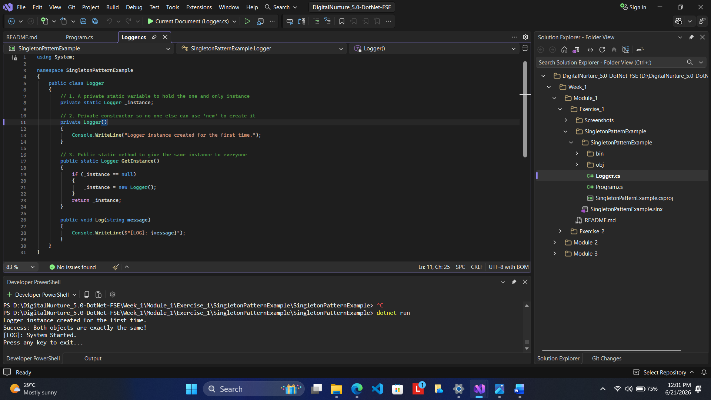

# Module 1: Exercise 1 - Singleton Design Pattern

## 1. Problem Statement
In many applications, we need a single shared resource, like a Logger or a Database Connection. Creating multiple instances of these objects wastes memory and can lead to inconsistent data. The goal is to implement a `Logger` class that ensures only **one instance** is created and shared across the entire application [3].

## 2. Steps Performed
1. **Private Constructor:** Created a `private Logger()` constructor to prevent other classes from using the `new` keyword to create extra instances.
2. **Static Instance:** Created a `private static Logger` variable to hold the single instance of the class.
3. **Public Access Point:** Implemented a `public static Logger GetInstance()` method. This method checks if an instance already exists; if not, it creates one.
4. **Validation:** In `Program.cs`, I requested the instance twice and compared them to prove they are the same object.

## 3. Expected Output
The console should display a message confirming that "Both objects are the same instance" and show the log messages being processed by that single instance.

## 4. Conclusion
The Singleton pattern provides a controlled, global point of access to a shared resource. This implementation ensures memory efficiency and centralized logging, which is a foundational engineering concept for robust software [3, 4].

## 5. Output (Screenshot)
