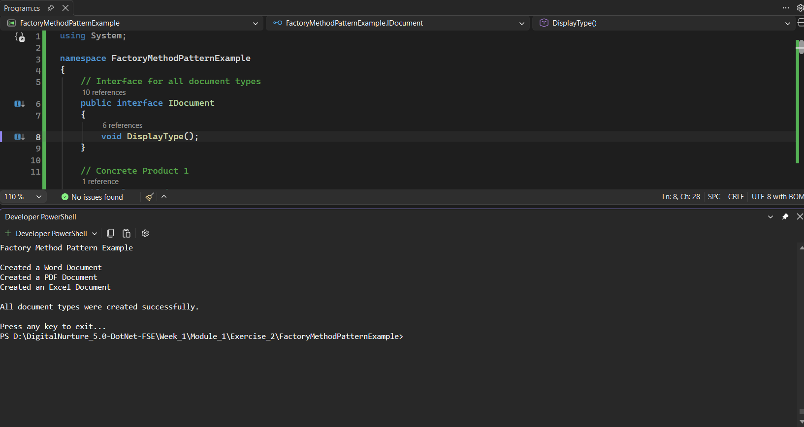

# Module 1: Exercise 2 - Implementing the Factory Method Pattern

## 1. Problem Statement

A document management system needs to create different types of documents such as Word, PDF, and Excel documents. The objective is to implement the Factory Method Pattern so that object creation is handled by dedicated factory classes rather than directly creating objects in the client code. This promotes loose coupling, better maintainability, and scalability of the application.

---

## 2. Steps Performed

### Step 1: Create a New Project

Created a C# Console Application named `FactoryMethodPatternExample`.

### Step 2: Define the Document Interface

Created an interface named `IDocument` containing the method:

```csharp
void DisplayType();
```

This interface acts as a common contract for all document types.

### Step 3: Create Concrete Document Classes

Implemented the following document classes:

- `WordDocument`
- `PdfDocument`
- `ExcelDocument`

Each class implements the `IDocument` interface and provides its own implementation of the `DisplayType()` method.

### Step 4: Create the Factory Classes

Created an abstract factory class named `DocumentFactory` containing the abstract method:

```csharp
public abstract IDocument CreateDocument();
```

Implemented the following concrete factory classes:

- `WordDocumentFactory`
- `PdfDocumentFactory`
- `ExcelDocumentFactory`

Each factory overrides the `CreateDocument()` method and creates its respective document object.

### Step 5: Test the Factory Method Implementation

Created factory objects in the `Main()` method and used them to generate different document types. The created document types were then displayed on the console to verify the implementation.

---

## 3. Expected Output

```text
Factory Method Pattern Example

Created a Word Document (.docx)
Created a PDF Document (.pdf)
Created an Excel Document (.xlsx)

All document types were created successfully.
```

---

## 4. Conclusion

The Factory Method Pattern was successfully implemented using C#. Different document types were created through dedicated factory classes instead of direct object instantiation. This approach separates object creation logic from client code, improves maintainability, supports extensibility, and follows object-oriented design principles.

---

## 5. Output Screenshot

