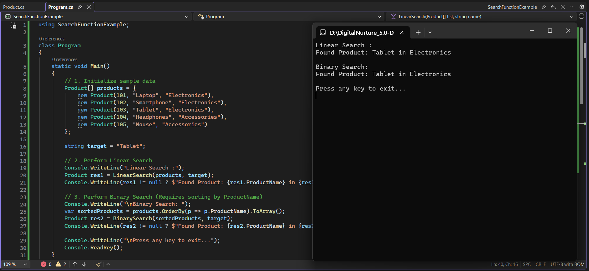

# Module 2: Exercise 1 - E-commerce Platform Search Function

## 1. Problem Statement
Search functionality is a critical component in e-commerce systems where large numbers of products must be processed efficiently. The objective of this exercise is to implement and compare two fundamental searching techniques—Linear Search and Binary Search—and analyze their behavior on a product dataset.

This helps in understanding how algorithm choice impacts performance in real-world applications.

---

## 2. Steps Performed

1. **Project Setup**  
   Created a new C# Console Application named `SearchFunctionExample` inside the directory:  
   `D:\DigitalNurture_5.0-DotNet-FSE\Week_1\Module_2\Exercise_1`

---

2. **Data Model Creation (Product Class)**  
   Created a `Product` class in `Product.cs` with the following properties:
   - ProductId (int)
   - ProductName (string)
   - Category (string)

   A constructor was implemented to initialize product objects easily.

---

3. **Sample Data Initialization**  
   In `Program.cs`, an array of `Product` objects was created with sample values such as:
   - Laptop
   - Smartphone
   - Tablet
   - Headphones
   - Mouse

   These represent an e-commerce product catalog used for searching.

---

4. **Linear Search Implementation**  
   A `LinearSearch` method was implemented which:
   - Iterates through each product one by one
   - Compares `ProductName` with the target value
   - Uses case-insensitive comparison
   - Returns the matching product if found

   This demonstrates a simple brute-force search approach.

---

5. **Sorting for Binary Search**  
   Before performing Binary Search, the product array is sorted using LINQ:
   ```csharp
   products.OrderBy(p => p.ProductName).ToArray();

This ensures the dataset is in the correct order required for Binary Search.

---

6. **Binary Search Implementation**
   A `BinarySearch` method was implemented which:

   * Works on a sorted array
   * Repeatedly divides the search space into halves
   * Uses string comparison to determine direction of search
   * Returns the matching product efficiently

---

7. **Program Execution Flow**

   * Linear Search is executed first
   * Binary Search is executed on the sorted array
   * Both results are printed to the console
   * Target searched: `"Tablet"`

---

## 3. Expected Output

When executed, the program produces:

```
Linear Search :
Found Product: Tablet in Electronics

Binary Search :
Found Product: Tablet in Electronics
```

---

## 4. Complexity Analysis

| Algorithm     | Time Complexity | Space Complexity |
| ------------- | --------------- | ---------------- |
| Linear Search | O(n)            | O(1)             |
| Binary Search | O(log n)        | O(1)             |

---

## 5. Conclusion

This exercise demonstrates the trade-off between simplicity and efficiency in search algorithms. Linear Search is straightforward but inefficient for large datasets. Binary Search is significantly faster but requires sorted data, making it more suitable for scalable e-commerce applications.

---

## 6. Output (Screenshot)



