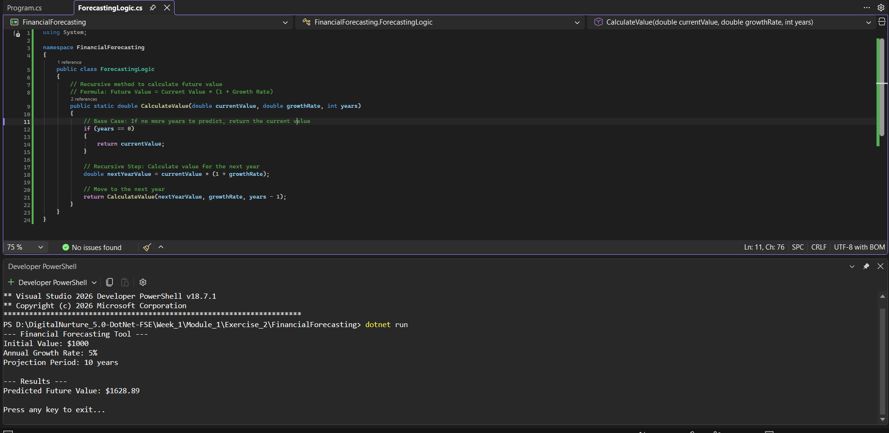

# Module 2: Exercise 2 - Financial Forecasting using Recursion

## 1. Problem Statement
The objective of this exercise is to develop a financial forecasting tool designed to predict future investment values based on historical growth data. This task requires the application of recursive algorithms to simplify the mathematical process of compounding interest over time. The program must calculate the future value of an initial investment by applying a constant annual growth rate over a specified number of years.

## 2. Steps Performed

1. **Algorithm Analysis**: Conducted research to determine how recursion could be applied to financial compounding by identifying the base case (years = 0) and the recursive step (Value × (1 + Growth Rate)).

2. **Project Initialization**: Created a new C# Console Application named `FinancialForecasting` targeting the .NET 8 framework.

3. **Designing the Recursive Method**: Developed a core method `CalculateValue` that accepts three parameters:
   - Current investment value  
   - Annual growth rate  
   - Remaining projection years  

4. **Main Implementation**: Configured `Program.cs` to initialize test data:
   - Initial Investment: $1000  
   - Annual Growth Rate: 5%  
   - Time Period: 10 years  

5. **Execution and Documentation**: Verified the correctness of the recursive logic and captured terminal output as proof of completion.

## 3. Expected Output

When executed, the terminal displays:

- Initial Value: $1000  
- Annual Growth Rate: 5%  
- Projection Period: 10 years  
- **Predicted Future Value: $1628.89**

## 4. Complexity Analysis

| Algorithm               | Time Complexity | Space Complexity |
|------------------------|----------------|------------------|
| Recursive Forecasting  | O(n)           | O(n)             |

**Note:** Space complexity is O(n) due to the recursion call stack depth, where *n* is the number of years.

## 5. Conclusion

This exercise demonstrates that recursion provides a clean and intuitive approach to modeling repetitive financial growth. However, it is not always optimal for large inputs due to stack usage. Improvements can be made using memoization or iterative methods to reduce space complexity.

## 6. Output (Screenshot)

