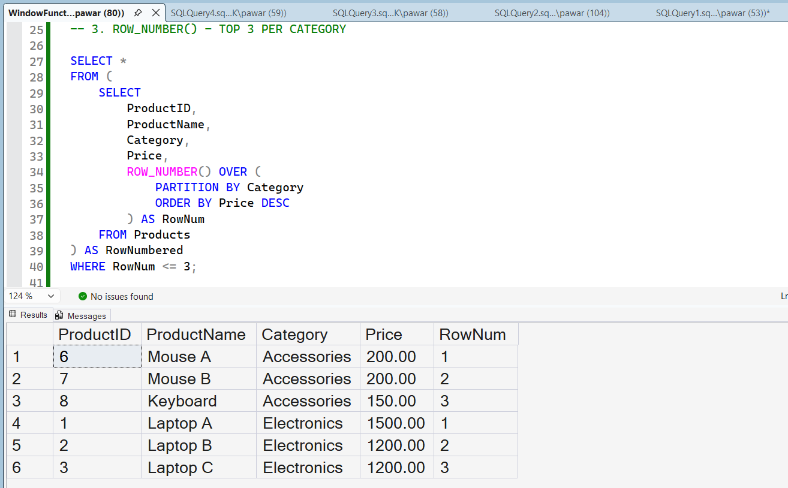
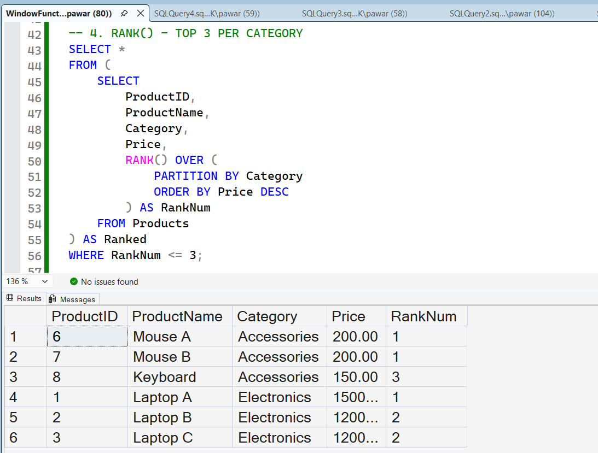
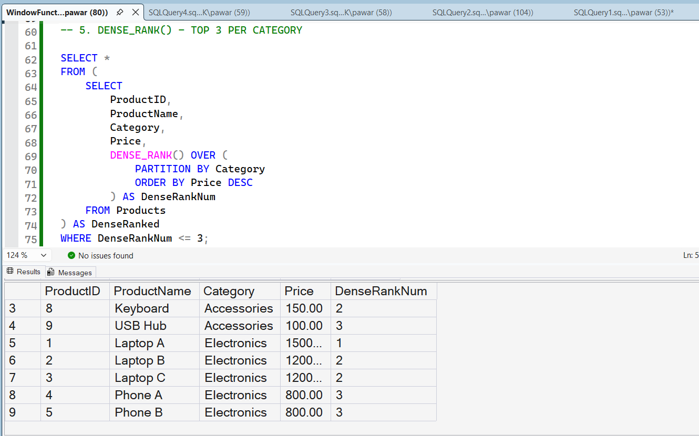

# Module 3 - Exercise 1: Ranking and Window Functions

## 1. Problem Statement

The objective of this exercise is to understand and implement SQL Server window functions to perform ranking operations on grouped data.

A sample `Products` table is used containing the following columns:
- ProductID
- ProductName
- Category
- Price

The main goal of this exercise is to:
- Apply SQL window functions: `ROW_NUMBER()`, `RANK()`, and `DENSE_RANK()`
- Partition the data by `Category`
- Sort products within each category based on `Price` in descending order
- Extract the Top 3 products per category using each ranking method

This exercise helps in understanding how SQL handles ranking in real-world scenarios such as:
- Product listings
- Leaderboards
- Analytical reporting systems

It also demonstrates how different ranking functions behave when duplicate values (ties) exist in the dataset.

---

## 2. Steps Performed

### Step 1: Table Creation
A table named `Products` is created to store product information.

It contains the following fields:
- ProductID (INT) → Unique identifier for each product
- ProductName (VARCHAR) → Name of the product
- Category (VARCHAR) → Product category (e.g., Electronics, Accessories)
- Price (DECIMAL) → Price of the product

---

### Step 2: Data Insertion
Sample records are inserted into the table.

The dataset is intentionally designed with duplicate prices in different categories to demonstrate how ranking functions handle ties:
- Electronics category includes duplicate prices (1200, 800)
- Accessories category includes duplicate prices (200)

This ensures meaningful comparison between ranking methods.

---

### Step 3: ROW_NUMBER() Implementation
The `ROW_NUMBER()` function assigns a unique sequential number to each row within a category.

Key behavior:
- Every row gets a unique rank
- Even if two products have the same price, they receive different ranks
- No ties are considered

This method is useful when a strict ordering is required without grouping duplicates.

---

### Step 4: RANK() Implementation
The `RANK()` function assigns the same rank to rows with identical values.

Key behavior:
- Equal prices receive the same rank
- A gap is created in the ranking sequence after ties

This is useful in competitive scenarios where tied positions exist.

---

### Step 5: DENSE_RANK() Implementation
The `DENSE_RANK()` function is similar to `RANK()` but does not create gaps.

Key behavior:
- Equal values receive the same rank
- No gaps in ranking sequence after ties

This is useful in analytical reporting where continuous ranking is required.

---

### Step 6: Top 3 Filtering Using Derived Tables
Each ranking function is applied inside a derived table (subquery).

After ranking is calculated, filtering is applied using:

WHERE RankValue <= 3

This ensures that only the Top 3 ranked products per category are retrieved.

---

## 3. Expected Output

### ROW_NUMBER()
- Assigns unique ranking to every row
- Always returns exactly 3 rows per category
- Does not consider duplicate values

Example pattern:
1, 2, 3

---

### RANK()
- Assigns same rank to identical values
- Introduces gaps in ranking sequence after ties

Example pattern:
1, 2, 2, 4

This may result in fewer or unevenly distributed Top 3 results depending on ties.

---

### DENSE_RANK()
- Assigns same rank to identical values
- Does NOT introduce gaps in ranking sequence

Example pattern:
1, 2, 2, 3

This provides a clean and continuous ranking structure.

---

### Key Comparison Summary

| Function     | Handles Ties | Gaps in Ranking | Top 3 Reliability |
|--------------|-------------|------------------|-------------------|
| ROW_NUMBER   | No          | No               | Best (strict output) |
| RANK         | Yes         | Yes              | Variable output |
| DENSE_RANK   | Yes         | No               | Most consistent |

---

## 4. Conclusion

This exercise demonstrates how SQL Server window functions behave differently when applied to grouped datasets.

Key learnings:
- `ROW_NUMBER()` generates a strict sequence without considering duplicates
- `RANK()` assigns equal ranks but introduces gaps in numbering
- `DENSE_RANK()` assigns equal ranks without gaps, making it more stable for analysis
- Derived tables allow filtering after applying window functions, which is essential for Top N queries

These concepts are widely used in:
- Data analytics
- Reporting systems
- Leaderboards
- Business intelligence dashboards

---

## 5. Output (Screenshots)

The following outputs are generated and included as part of the submission:

### Method 1: ROW_NUMBER()
This output shows unique ranking for each product within its category.

---

### Method 2: RANK()
This output shows ranking with gaps where ties occur.

---

### Method 3: DENSE_RANK()
This output shows ranking without gaps, even when ties exist.

