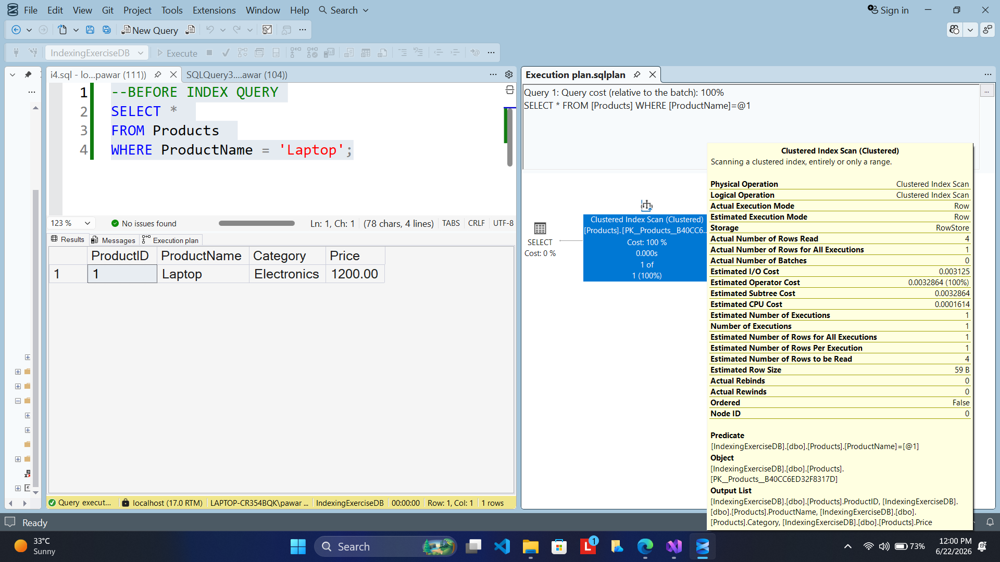
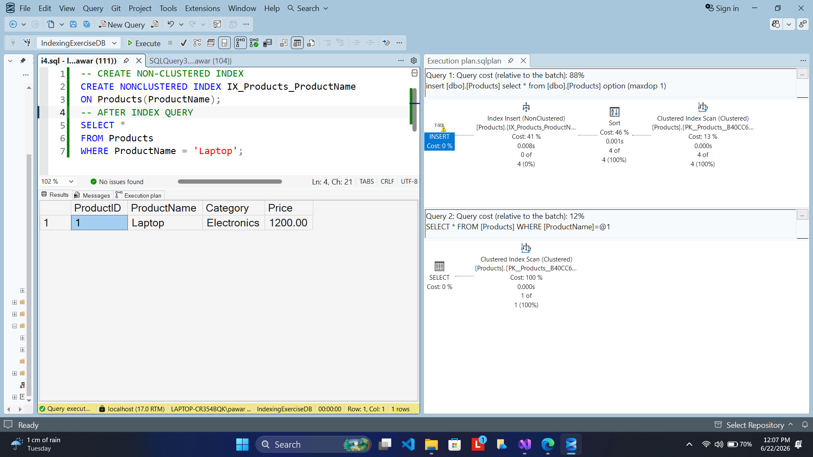
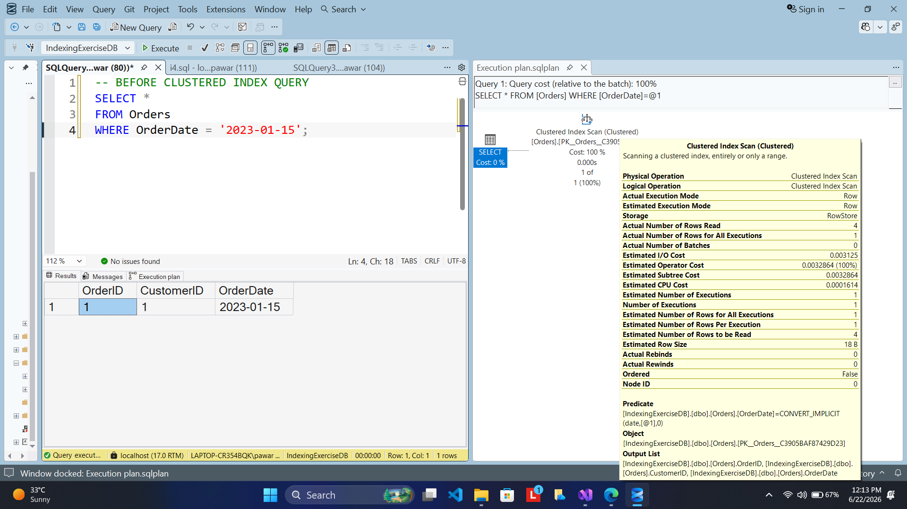
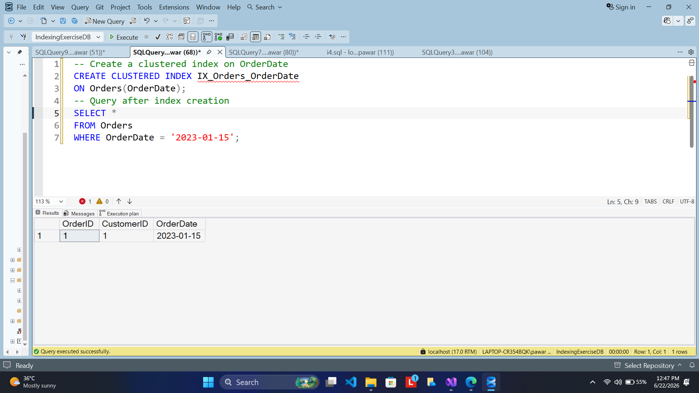
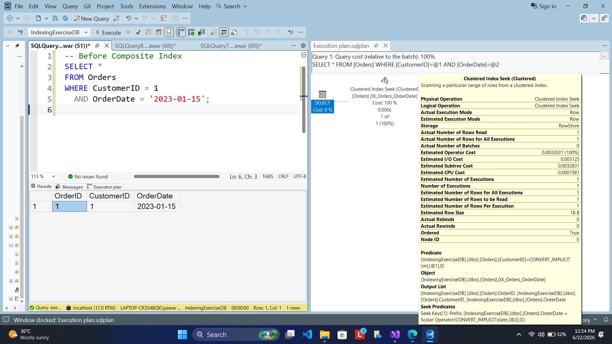
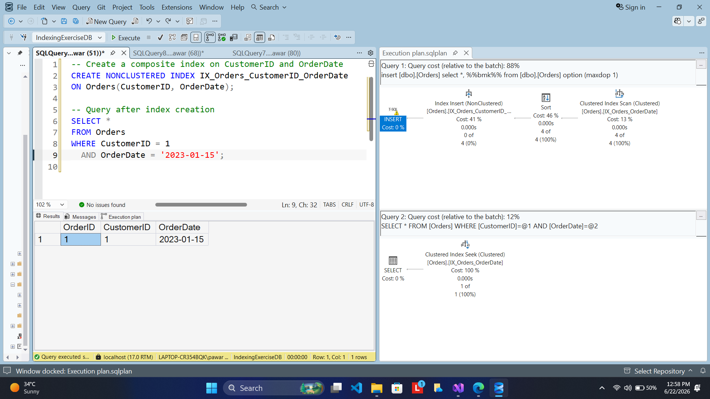

# Module 3 - Exercise 2: SQL Indexing

## 1. Problem Statement

The objective of this exercise is to understand the implementation and impact of different types of indexes in SQL Server.

Indexes improve the speed of data retrieval operations by allowing SQL Server to locate rows efficiently without scanning the entire table.

The exercise focuses on:

* Creating a Non-Clustered Index
* Creating a Clustered Index
* Creating a Composite Index
* Comparing query execution behavior before and after index creation using Execution Plans

The database consists of the following tables:

* Customers
* Products
* Orders
* OrderDetails

Sample data is inserted into these tables to demonstrate indexing operations and query optimization.

---

## 2. Steps Performed

### Step 1: Database Creation

Created the following tables:

* Customers
* Products
* Orders
* OrderDetails

Primary keys and foreign key relationships were defined to maintain data integrity.

---

### Step 2: Data Population

Inserted sample records into all tables.

The sample data provides sufficient records for demonstrating query execution before and after index creation.

---

## Exercise 1: Non-Clustered Index

### Objective

Create a Non-Clustered Index on the `ProductName` column of the `Products` table and analyze query execution.

### Before Index Creation

Executed:

```sql
SELECT *
FROM Products
WHERE ProductName = 'Laptop';
```

Observed the execution plan before creating the index.

### Index Creation

```sql
CREATE NONCLUSTERED INDEX IX_Products_ProductName
ON Products(ProductName);
```

### After Index Creation

Executed the same query again:

```sql
SELECT *
FROM Products
WHERE ProductName = 'Laptop';
```

Observed the execution plan after index creation.

---

## Exercise 2: Clustered Index

### Objective

Create a Clustered Index on the `OrderDate` column of the `Orders` table and analyze query execution.

### Before Index Creation

Executed:

```sql
SELECT *
FROM Orders
WHERE OrderDate = '2023-01-15';
```

Observed the execution plan before creating the index.

### Index Creation

The existing clustered primary key was modified to allow creation of a clustered index on `OrderDate`.

Created:

```sql
CREATE CLUSTERED INDEX IX_Orders_OrderDate
ON Orders(OrderDate);
```

### After Index Creation

Executed the same query again:

```sql
SELECT *
FROM Orders
WHERE OrderDate = '2023-01-15';
```

Observed the execution plan after index creation.

---

## Exercise 3: Composite Index

### Objective

Create a Composite Index on the `CustomerID` and `OrderDate` columns of the `Orders` table.

### Before Index Creation

Executed:

```sql
SELECT *
FROM Orders
WHERE CustomerID = 1
AND OrderDate = '2023-01-15';
```

Observed the execution plan before index creation.

### Index Creation

```sql
CREATE NONCLUSTERED INDEX IX_Orders_CustomerID_OrderDate
ON Orders(CustomerID, OrderDate);
```

### After Index Creation

Executed the same query again:

```sql
SELECT *
FROM Orders
WHERE CustomerID = 1
AND OrderDate = '2023-01-15';
```

Observed the execution plan after index creation.

---

## 3. Expected Output

### Exercise 1: Non-Clustered Index

Before Index:

* SQL Server scans existing table/index structures to locate records.

After Index:

* SQL Server can use the non-clustered index on ProductName for faster lookup.

---

### Exercise 2: Clustered Index

Before Index:

* Query execution requires scanning rows based on the existing storage order.

After Index:

* Data is physically organized according to OrderDate.
* Queries filtering by OrderDate become more efficient.

---

### Exercise 3: Composite Index

Before Index:

* SQL Server evaluates multiple conditions without a dedicated composite index.

After Index:

* SQL Server can efficiently search using both CustomerID and OrderDate.
* Multi-column filtering performance is improved.

---

## 4. Index Comparison

| Index Type          | Description                                                  | Best Use Case                               |
| ------------------- | ------------------------------------------------------------ | ------------------------------------------- |
| Non-Clustered Index | Stores a separate index structure with pointers to data rows | Frequently searched columns                 |
| Clustered Index     | Physically arranges table data according to indexed column   | Range searches and sorting                  |
| Composite Index     | Index built on multiple columns                              | Queries using multiple filtering conditions |

---

## 5. Conclusion

This exercise demonstrated the practical implementation of SQL Server indexing techniques.

Key observations:

* Non-Clustered Indexes improve search performance on specific columns.
* Clustered Indexes physically organize data and optimize range-based queries.
* Composite Indexes enhance performance when multiple columns are used together in query conditions.
* Execution Plans provide insight into how SQL Server accesses data and utilizes indexes.

Understanding indexing techniques is essential for database optimization, query tuning, and improving application performance.

---

## 6. Output (Screenshots)

### Exercise 1 - Before Non-Clustered Index



### Exercise 1 - After Non-Clustered Index



---

### Exercise 2 - Before Clustered Index



### Exercise 2 - After Clustered Index



---

### Exercise 3 - Before Composite Index



### Exercise 3 - After Composite Index


