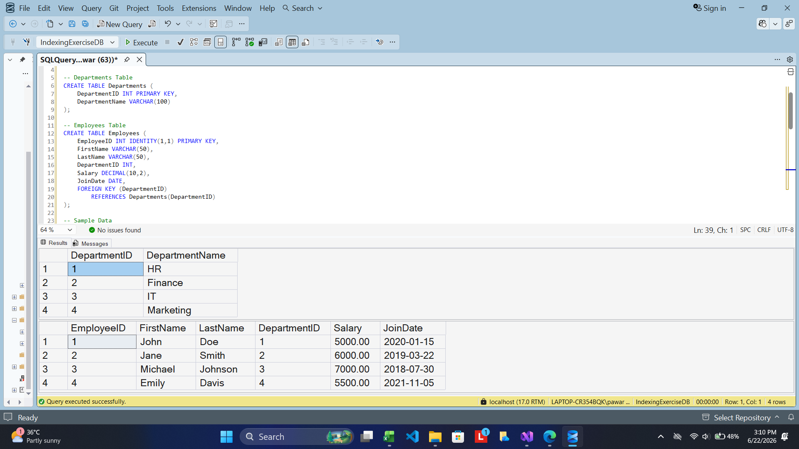
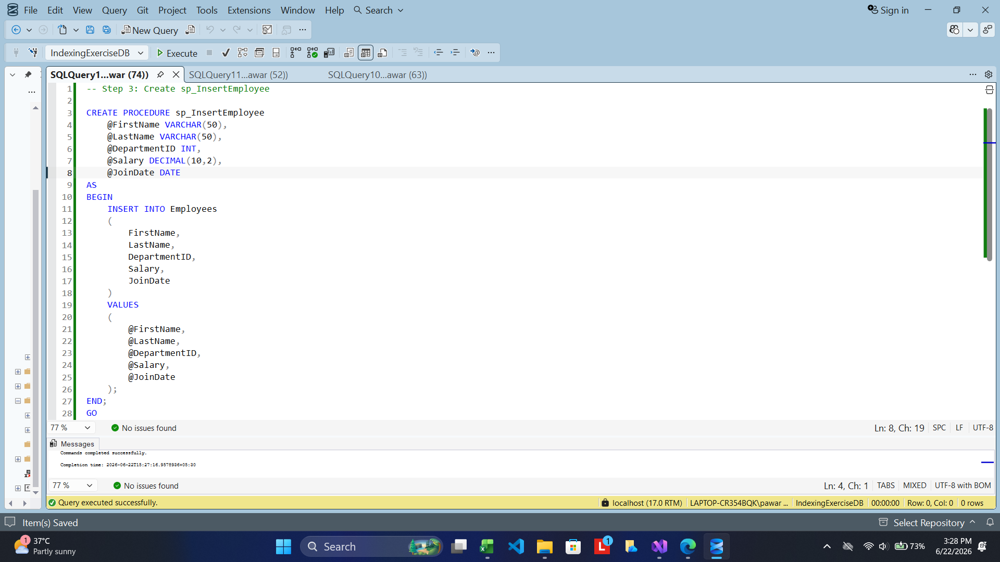
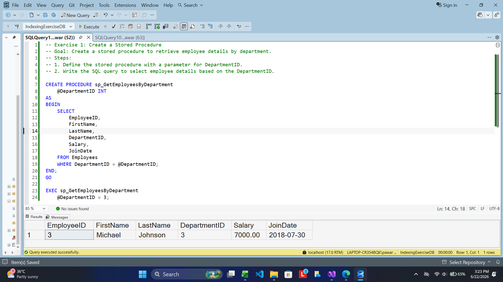
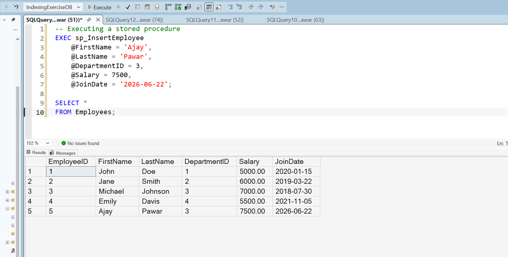
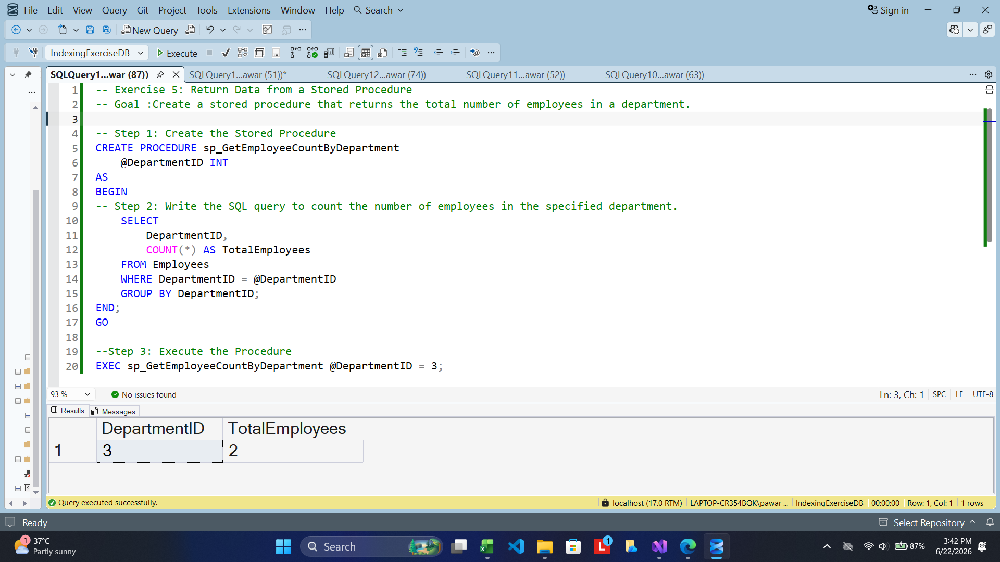

# SQL Stored Procedures

## Introduction

This exercise demonstrates the implementation and execution of SQL Server stored procedures using an Employee Management System database. The objective is to understand how stored procedures can be used to encapsulate SQL logic, perform data manipulation operations, and return meaningful information from a database.

The database consists of two related tables:

- Departments
- Employees

The Departments table stores department information, while the Employees table stores employee details and references the department to which each employee belongs.

---

## Database Creation and Sample Data

The first step was to create the required tables and populate them with sample records. The Departments table contains department information, and the Employees table stores employee records including salary, joining date, and department association.

After creating the tables, sample data was inserted to provide a dataset for testing the stored procedures developed in later exercises.

### Database and Tables



---

## Exercise 1 – Creating a Stored Procedure

The objective of this exercise was to create a stored procedure named `sp_InsertEmployee`.

This procedure accepts employee information as input parameters and inserts a new employee record into the Employees table. By using a stored procedure, the insertion logic can be reused without repeatedly writing the same SQL INSERT statement.

The procedure accepts the following parameters:

- First Name
- Last Name
- Department ID
- Salary
- Joining Date

The values provided through these parameters are inserted directly into the Employees table.

### Stored Procedure

```sql
CREATE PROCEDURE sp_InsertEmployee
    @FirstName VARCHAR(50),
    @LastName VARCHAR(50),
    @DepartmentID INT,
    @Salary DECIMAL(10,2),
    @JoinDate DATE
AS
BEGIN
    INSERT INTO Employees
    (
        FirstName,
        LastName,
        DepartmentID,
        Salary,
        JoinDate
    )
    VALUES
    (
        @FirstName,
        @LastName,
        @DepartmentID,
        @Salary,
        @JoinDate
    );
END;
GO
```

### Outputs

Here I created a procedure to insert employee details.



Executed the stored procedure.



---

## Exercise 4 – Executing a Stored Procedure

After creating the stored procedure, it was executed by passing employee details as input parameters.

A new employee record was inserted into the Employees table using the procedure. To verify successful execution, the Employees table was queried and the newly inserted record appeared in the result set.

The following command was used to execute the procedure:

```sql
EXEC sp_InsertEmployee
    @FirstName = 'Ajay',
    @LastName = 'Pawar',
    @DepartmentID = 3,
    @Salary = 7500,
    @JoinDate = '2026-06-22';
```

After execution, a SELECT query was used to confirm that the employee had been successfully added to the database.

### Output



---

## Exercise 5 – Returning Data from a Stored Procedure

The objective of this exercise was to create a stored procedure that returns the total number of employees belonging to a specified department.

A procedure named `sp_GetEmployeeCountByDepartment` was created. The procedure accepts a Department ID as input and calculates the number of employees assigned to that department using the COUNT() aggregate function.

### Stored Procedure

```sql
CREATE PROCEDURE sp_GetEmployeeCountByDepartment
    @DepartmentID INT
AS
BEGIN
    SELECT
        DepartmentID,
        COUNT(*) AS TotalEmployees
    FROM Employees
    WHERE DepartmentID = @DepartmentID
    GROUP BY DepartmentID;
END;
GO
```

The procedure was executed for Department ID 3.

```sql
EXEC sp_GetEmployeeCountByDepartment
    @DepartmentID = 3;
```

The result displayed the department identifier along with the total number of employees currently assigned to that department.

### Output



---

## Conclusion

This exercise provided practical experience with SQL Server stored procedures. The implementation demonstrated how stored procedures can be used to insert records, execute parameterized operations, and return aggregated information from a database. These techniques improve code reusability, maintainability, and database security by centralizing SQL logic within the database layer.