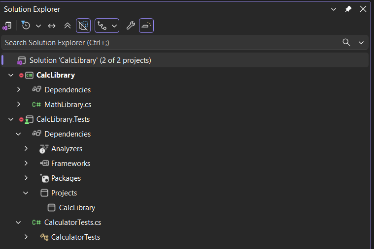
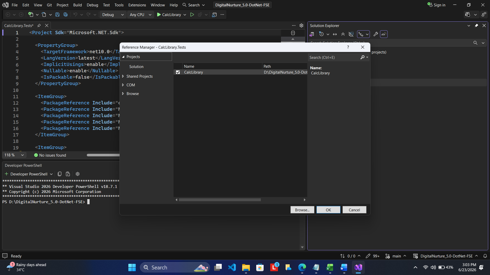
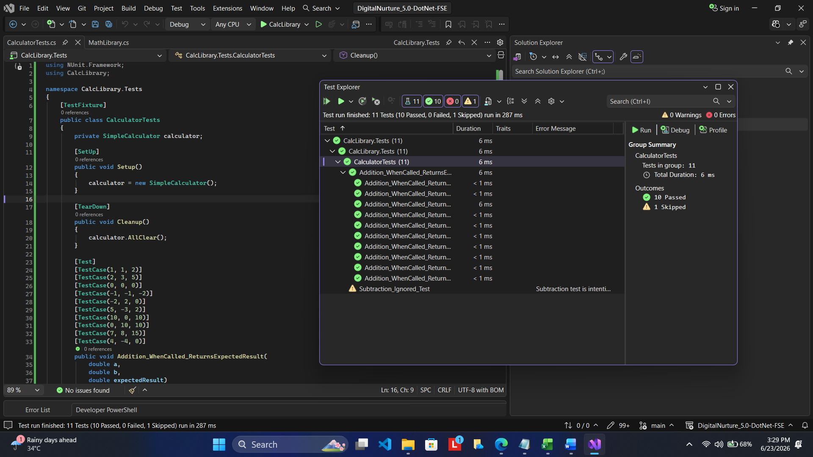

# Module 4 - Exercise 1: NUnit Handson

## Problem Statement

The objective of this handson is to understand the fundamentals of Unit Testing using NUnit. The task involves creating a dedicated NUnit test project, adding references to the calculator library, writing automated test cases, and validating application functionality using assertions.

The calculator library provided in the handson contains methods for performing arithmetic operations. NUnit is used to verify that the implemented methods produce the expected results. The exercise demonstrates how automated testing helps improve software quality and reliability.

---

## Objectives

The following concepts were studied and implemented as part of this exercise:

* Understanding Unit Testing and its purpose.
* Differentiating Unit Testing from Functional Testing.
* Understanding various testing types:

  * Unit Testing
  * Functional Testing
  * Automated Testing
  * Performance Testing
* Learning the benefits of automated testing.
* Understanding loosely coupled and testable design.
* Creating an NUnit Test Project.
* Writing and executing NUnit test cases.
* Using parameterized test cases with the TestCase attribute.
* Validating expected results using Assert.That().

---

## Project Structure

The solution consists of two projects.

### CalcLibrary

This project contains the calculator implementation and business logic. It provides methods for performing arithmetic operations such as Addition, Subtraction, Multiplication, and Division.

### CalcLibrary.Tests

This project contains the NUnit test cases used to validate the functionality of the calculator library.

```text
CalcLibrary.sln
│
├── CalcLibrary
│   ├── CalcLibrary.csproj
│   └── MathLibrary.cs
│
└── CalcLibrary.Tests
    ├── CalcLibrary.Tests.csproj
    └── CalculatorTests.cs
```

---

## Steps Performed

### Step 1: Create NUnit Test Project

A new NUnit Test Project was created and added to the existing solution. This project serves as a separate environment where application functionality can be validated independently from the production code.

### Step 2: Add Project Reference

A project reference was added from the NUnit test project to the CalcLibrary project. This allows the test project to access the calculator methods and classes that need to be tested.

### Step 3: Create the Test Class

A test class named `CalculatorTests` was created inside the NUnit project. This class contains all the automated test cases required for validating calculator operations.

### Step 4: Implement NUnit Attributes

The following NUnit attributes were implemented as part of the handson:

#### TestFixture

Identifies the class as an NUnit test class.

#### SetUp

Executes before every test case and initializes the required objects.

#### TearDown

Executes after every test case and performs cleanup activities.

#### Test

Marks a method as a test case.

#### TestCase

Allows execution of the same test method using multiple input values.

#### Ignore

Demonstrates how test cases can be temporarily excluded from execution.

### Step 5: Execute Tests

All test cases were executed using Visual Studio Test Explorer. The execution results were verified to ensure that the calculator functionality behaved as expected.

---

## Solution Structure

The following screenshot shows the complete Visual Studio solution structure containing both the CalcLibrary project and the NUnit test project.



---

## Project Reference Added

The following screenshot confirms that the CalcLibrary project has been successfully added as a reference to the CalcLibrary.Tests project.



---

## Test Execution Results

The following screenshot shows the successful execution of all NUnit test cases through Visual Studio Test Explorer.



---

## Expected Output

The Addition method should return the correct result for all supplied input values.

Example test cases:

| Input A | Input B | Expected Result |
| ------- | ------- | --------------- |
| 1       | 1       | 2               |
| 2       | 3       | 5               |
| -2      | 2       | 0               |
| 10      | 0       | 10              |
| 20      | 30      | 50              |

All configured NUnit test cases should execute successfully and pass without failures.

---

## Actual Output

The NUnit framework executed all configured test cases successfully through Visual Studio Test Explorer.

The observed results were:

* Solution built successfully.
* Test project loaded successfully.
* Project reference resolved correctly.
* Parameterized test cases executed successfully.
* Expected and actual results matched.
* All tests passed without failures.

The output confirms that the calculator functionality behaves as expected for the tested scenarios.

---

## NUnit Concepts Demonstrated

The following NUnit concepts were implemented during this exercise:

* TestFixture
* SetUp
* TearDown
* Test
* TestCase
* Ignore
* Assert.That()

These features help create maintainable, reusable, and automated unit tests that can be executed repeatedly throughout the software development lifecycle.

---

## Conclusion

This handson successfully demonstrated the process of writing and executing automated unit tests using NUnit. A dedicated test project was created, project references were configured, parameterized test cases were implemented, and the calculator functionality was validated using assertions.

The exercise highlights the importance of automated testing in software development and demonstrates how NUnit can be used to verify application behavior efficiently and consistently.
