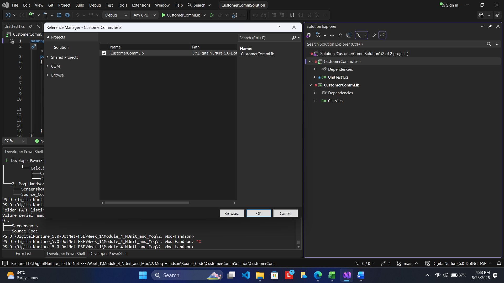
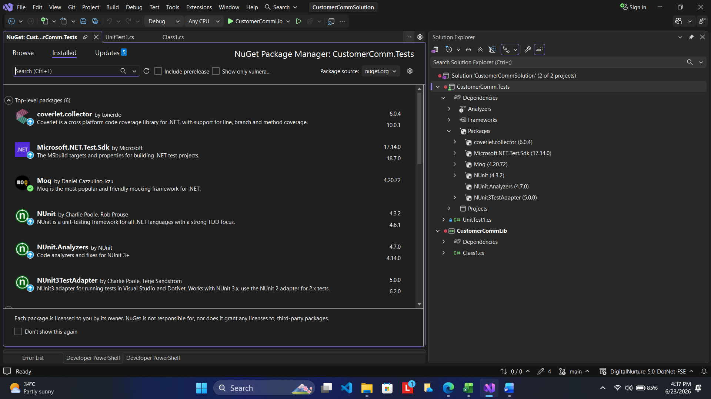
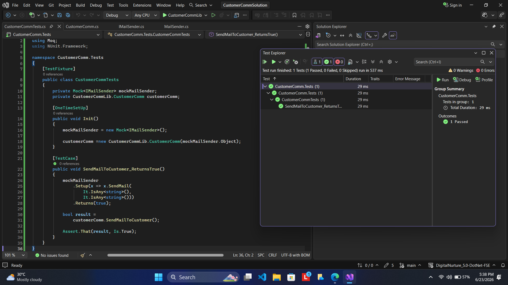

# 1. Moq-Handson - Exercise 1: Write Testable Code with Moq

## Problem Statement

In enterprise applications, business modules often depend on external services such as SMTP mail servers, databases, web APIs, and file systems. Directly invoking these dependencies during unit testing makes tests slower, harder to maintain, and dependent on external infrastructure.

The objective of this exercise is to demonstrate how Dependency Injection and the Moq framework can be used to isolate external dependencies and create testable code. A mail sending component is developed and then unit tested without actually sending emails by replacing the real dependency with a mock object.

---

# Objectives

This exercise helps in understanding:

* The concept of Mocking and its role in Test-Driven Development (TDD).
* The importance of isolation during unit testing.
* The difference between real objects and mock objects.
* Dependency Injection using Constructor Injection.
* Creating testable code by removing direct dependencies on external services.
* Using the Moq framework to simulate external dependencies.
* Writing NUnit test cases for business logic.
* Verifying application behavior without communicating with a real SMTP server.

---

# Project Structure

```text
2. Moq-Handson
│
├── README.md
├── Screenshots
│   ├── 01_solution_structure.png
│   ├── 02_nuget_packages_installed.png
│   └── 03_test_explorer_results.png
│
└── Source_Code
    └── CustomerCommSolution
        │
        ├── CustomerCommSolution.sln
        │
        ├── CustomerCommLib
        │   ├── IMailSender.cs
        │   ├── MailSender.cs
        │   └── CustomerComm.cs
        │
        └── CustomerComm.Tests
            └── CustomerCommTests.cs
```

---

# Scenario

The application sends emails to customers whenever a transaction is completed. The email functionality communicates with an SMTP mail server.

Testing such functionality directly would require:

* A working SMTP server
* Network connectivity
* Valid email credentials

These dependencies make automated testing difficult.

To overcome this limitation, the mail sending functionality is abstracted through an interface (`IMailSender`) and injected into the business class (`CustomerComm`). During testing, a mock implementation of the interface is supplied using the Moq framework.

This approach allows the business logic to be tested independently of the SMTP server.

---

# Steps Performed

## Step 1: Created the CustomerCommLib Class Library

A Class Library project named **CustomerCommLib** was created.

The library contains:

* `IMailSender` interface
* `MailSender` implementation
* `CustomerComm` business class

The `MailSender` class contains the SMTP communication logic.

---

## Step 2: Created the IMailSender Interface

An interface named `IMailSender` was defined to abstract the email sending functionality.

```csharp
public interface IMailSender
{
    bool SendMail(string toAddress, string message);
}
```

This abstraction allows different implementations to be supplied at runtime.

---

## Step 3: Implemented MailSender

The `MailSender` class implements the `IMailSender` interface and contains SMTP mail sending logic using:

* System.Net
* System.Net.Mail

This class represents the external dependency that should not be invoked during unit testing.

---

## Step 4: Created the CustomerComm Class

The `CustomerComm` class represents the business logic under test.

Dependency Injection was implemented through the constructor:

```csharp
public CustomerComm(IMailSender mailSender)
{
    _mailSender = mailSender;
}
```

The business method invokes the email sender through the interface:

```csharp
_mailSender.SendMail(
    "cust123@abc.com",
    "Some Message");
```

This design makes the class loosely coupled and testable.

---

## Step 5: Created NUnit Test Project

A separate test project named **CustomerComm.Tests** was created.

The following packages were installed:

* NUnit
* NUnit3TestAdapter
* Moq
* Microsoft.NET.Test.Sdk

A project reference to **CustomerCommLib** was added.

---

## Step 6: Created Mock Object using Moq

Instead of using the real `MailSender`, a mock object was created.

```csharp
mockMailSender = new Mock<IMailSender>();
```

The mock was configured to accept any two string parameters and always return `true`.

```csharp
mockMailSender
    .Setup(x => x.SendMail(
        It.IsAny<string>(),
        It.IsAny<string>()))
    .Returns(true);
```

---

## Step 7: Executed the Unit Test

The test invokes:

```csharp
customerComm.SendMailToCustomer();
```

Since the dependency is mocked, no actual SMTP communication occurs.

The test verifies that the method returns `true`.

```csharp
Assert.That(result, Is.True);
```

All tests executed successfully.

---

# Screenshots

## Solution Structure

This screenshot shows the solution containing the library project and the NUnit test project.



---

## Installed NuGet Packages

This screenshot shows the required NUnit and Moq packages installed in the test project.



---

## Test Execution Results

This screenshot shows the successful execution of the NUnit test case in Test Explorer.



---

# Expected Output

The mock object should replace the actual SMTP mail sender and return a successful response.

Expected result:

```text
SendMailToCustomer_ReturnsTrue
Passed
```

The test should execute without connecting to any mail server.

---

# Result

The mail sending dependency was successfully isolated using Dependency Injection and Moq. The business logic was unit tested independently without requiring SMTP server access.

The NUnit test executed successfully and returned the expected result.

---

# Conclusion

This exercise demonstrated how Moq can be used to create mock objects for external dependencies and how Dependency Injection enables loosely coupled and testable code. By replacing the actual SMTP mail sender with a mock implementation, the business logic was tested efficiently without interacting with real infrastructure.

The exercise also reinforced key concepts such as unit testing, mocking, isolation, constructor injection, and automated testing practices used in enterprise .NET applications.
