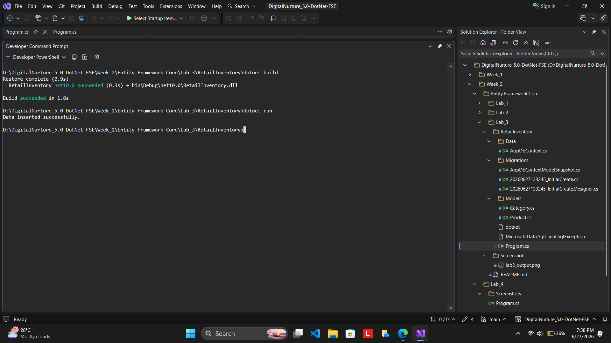
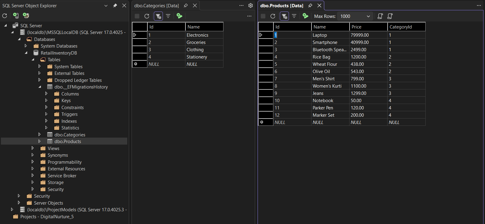

# Lab 4: Inserting Initial Data into the Database

## Scenario

The store manager wants to seed the Retail Inventory Management System with categories and initial products so that the application contains sample data for testing and operations.

Instead of manually entering records into the database, Entity Framework Core can be used to insert data directly through C# code. This approach makes data management easier and reduces manual database operations.

## Objective

Use Entity Framework Core to insert data into the database using `AddRangeAsync()` and `SaveChangesAsync()`. Ensure that the database is populated with sample categories and products.

## Understanding Data Insertion in Entity Framework Core

Entity Framework Core provides methods for adding records to database tables through entity objects.

In this lab, I inserted sample categories and products into the database using Entity Framework Core.

The following methods were used:

* AddRangeAsync()
* SaveChangesAsync()

### Purpose of AddRangeAsync()

The AddRangeAsync() method is used to add multiple records at the same time.

Example:

* Electronics
* Groceries

can be added together instead of inserting each record separately.

### Purpose of SaveChangesAsync()

The SaveChangesAsync() method saves all pending changes to the database.

Without calling SaveChangesAsync(), the records will not be stored in the database.

## Project Structure

This lab was implemented using the same Retail Inventory project created in Lab 3.

The complete project structure, entity classes, database context, migrations, and database configuration were already created in Lab 3.

For this lab, only the `Program.cs` file was updated to insert initial data into the database.

Refer to Lab 3 for the complete project structure.

## Procedure

### Step 1: Update Program.cs

The existing `Program.cs` file from Lab 3 was modified to insert categories and products into the database using Entity Framework Core.

The program creates category objects, product objects, establishes relationships between them, and saves the records to the database using `SaveChangesAsync()`.

### Step 2: Run the Application

Execute the application using:

```powershell
dotnet run
```

After successful execution, the following message is displayed:

```text
Data inserted successfully.
```

### Step 3: Verify Data in SQL Server

The Categories and Products tables were opened in SQL Server Object Explorer to verify that the records were inserted successfully.
The inserted products were also verified to be associated with their respective categories.

## Output

Look at the screenshots below:



This screenshot shows the successful execution of the application and confirms that the insertion operation completed successfully.



This screenshot shows the records stored in the Categories and Products tables and verifies that Entity Framework Core successfully inserted the data into the database.

## Analysis

Entity Framework Core allows developers to work with database records using C# objects instead of writing SQL insert statements manually.

`AddRangeAsync()` is used to add multiple records efficiently, while `SaveChangesAsync()` commits all pending changes to the database.

This approach improves code readability, simplifies database operations, and automatically manages relationships between entities.

## Result

Thus, the initial categories and products were successfully inserted into the Retail Inventory database using Entity Framework Core. The inserted data was verified in SQL Server, confirming successful data persistence and relationship mapping.