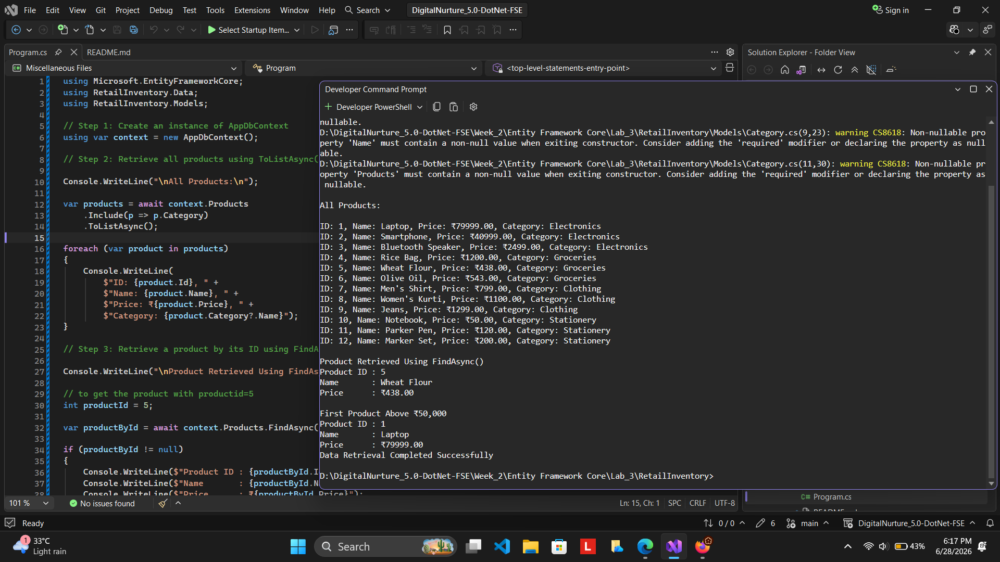

# Lab 5: Retrieving Data from the Database Using Entity Framework Core

## Scenario

The Retail Inventory Management System stores product information in a SQL Server database. The store manager wants to retrieve product details and display them on the dashboard.

Entity Framework Core provides various methods to fetch data from the database efficiently. In this lab, data retrieval operations were performed using asynchronous methods provided by Entity Framework Core.

## Objective

The objective of this lab is to retrieve data from the database using:

- `ToListAsync()`
- `FindAsync()`
- `FirstOrDefaultAsync()`

These methods help in fetching all records, retrieving a specific record by its primary key, and obtaining the first record that matches a given condition.

## Project Structure

This lab was implemented using the same **RetailInventory** project created in **Lab 3**.

The complete project structure, entity classes, database context, migrations, and database configuration were already created in Lab 3 and 
the database was populated with sample categories and products in Lab 4.
So, I used the same instances to complete the lab 5 operations.

For this lab,I the used the **Program.cs** file to perform data retrieval operations.
Refer to **Lab 3** for the complete project structure and database setup.
here is the idea for the same:

```text
RetailInventory
│
├── Data
│   └── AppDbContext.cs
│
├── Models
│   ├── Product.cs
│   └── Category.cs
│
├── Migrations
│   ├── InitialCreate.cs
│   ├── InitialCreate.Designer.cs
│   └── AppDbContextModelSnapshot.cs
│
├── Program.cs
```

## Implementation Steps:

### Step 1: Update Program.cs

The existing `Program.cs` file from the RetailInventory project was modified to retrieve product information from the database.

The program performs three different retrieval operations:

1. Retrieve all products using `ToListAsync()`.
2. Retrieve a specific product using `FindAsync()`.
3. Retrieve the first product that satisfies a condition using `FirstOrDefaultAsync()`.

### Step 2: Create AppDbContext Object

The program first creates an instance of the database context.

```csharp
using var context = new AppDbContext();


This object establishes communication between the application and the database.

### Step 3: Retrieve All Products

The following code retrieves all records from the Products table.

```csharp
var products = await context.Products
    .Include(p => p.Category)
    .ToListAsync();
```

### Explanation

* `Products` refers to the Products table.
* `Include()` loads the related Category information.
* `ToListAsync()` retrieves all records asynchronously and stores them in a list.

The retrieved products are displayed using a foreach loop.

### Step 4: Retrieve a Product by ID

The following code retrieves a specific product using its primary key.

```csharp
var productById = await context.Products.FindAsync(productId);
```

### Explanation

* `FindAsync()` searches for a record using the primary key.
* It returns the matching product if found.
* If no matching record exists, it returns null.

### Step 5: Retrieve the First Matching Product

The following code retrieves the first product whose price is greater than ₹50,000.

```csharp
var expensiveProduct = await context.Products
    .FirstOrDefaultAsync(p => p.Price > 50000);
```

### Explanation

* `FirstOrDefaultAsync()` returns the first record that satisfies the condition.
* If no matching record exists, it returns null.
* In this case, it searches for products priced above ₹50,000.

### Step 6: Execute the Application

Run the application using:

```powershell
dotnet run
```

The application displays:

* All products stored in the database.
* Product retrieved using its ID.
* First product matching the specified condition.

### Step 7: Verify the Database

The Products table was viewed using SQL Server Object Explorer to verify that the displayed records were present in the database.

## Output

Look at the screenshot below:



This screenshot shows:

* Successful execution of the application.
* Retrieval of all products from the database.
* Retrieval of a product using `FindAsync()`.
* Retrieval of a product using `FirstOrDefaultAsync()`.

Look at the screenshot below:


This screenshot shows:

* Records available in the Products table.
* Verification that the retrieved records exist in the database.

## Analysis

Entity Framework Core provides multiple methods for retrieving data depending on the requirement.
You can replace that section with the following more detailed explanation:

### 1. ToListAsync()

`ToListAsync()` is used when we want to retrieve all records (or all records that match a condition) from a database table.

```csharp
var products = await context.Products.ToListAsync();
```

#### How it works

1. Entity Framework Core translates the LINQ query into an SQL query.
2. The SQL query is sent to the database.
3. The database returns all matching rows.
4. Entity Framework Core converts each row into a Product object.
5. All Product objects are stored inside a List<Product> collection.

#### Example

Suppose the Products table contains:

| Id | Name       | Price |
| -- | ---------- | ----- |
| 1  | Laptop     | 79999 |
| 2  | Smartphone | 40999 |
| 3  | Rice Bag   | 1200  |

After executing:

```csharp
var products = await context.Products.ToListAsync();
```

the variable `products` will contain a list of all three Product objects.

### 2. FindAsync()

`FindAsync()` is used to retrieve a specific record using its Primary Key value.

```csharp
var product = await context.Products.FindAsync(1);
```

#### How it works

1. Entity Framework Core looks for the record with the specified primary key.
2. If the entity is already loaded in memory, EF Core returns it immediately without querying the database.
3. If the entity is not available in memory, EF Core generates an SQL query and fetches it from the database.
4. The matching record is converted into a Product object.

#### Example

Products table:

| Id | Name       | Price |
| -- | ---------- | ----- |
| 1  | Laptop     | 79999 |
| 2  | Smartphone | 40999 |
| 3  | Rice Bag   | 1200  |

When executing:

```csharp
var product = await context.Products.FindAsync(2);
```

EF Core searches for Product ID 2 and returns:

```text
Smartphone
```

### 3. FirstOrDefaultAsync()

`FirstOrDefaultAsync()` is used to retrieve the first record that satisfies a given condition.

```csharp
var product = await context.Products
    .FirstOrDefaultAsync(p => p.Price > 50000);
```

#### How it works

1. Entity Framework Core converts the condition into an SQL WHERE clause.
2. The database searches for matching records.
3. The first matching record is returned.
4. If no record satisfies the condition, the method returns `null`.

#### Example

Products table:

| Id | Name       | Price |
| -- | ---------- | ----- |
| 1  | Laptop     | 79999 |
| 2  | Smartphone | 40999 |
| 3  | Rice Bag   | 1200  |

Executing:

```csharp
var product = await context.Products
    .FirstOrDefaultAsync(p => p.Price > 50000);
```

returns:

```text
Laptop
```

because it is the first product whose price is greater than ₹50,000.

If no product satisfies the condition, the result will be:

```csharp
null
```

## Result

Thus, data was successfully retrieved from the Retail Inventory database using Entity Framework Core. The operations `ToListAsync()`, `FindAsync()`, and `FirstOrDefaultAsync()` were implemented and tested successfully. The retrieved records were verified using SQL Server, confirming successful interaction between the application and the database.
