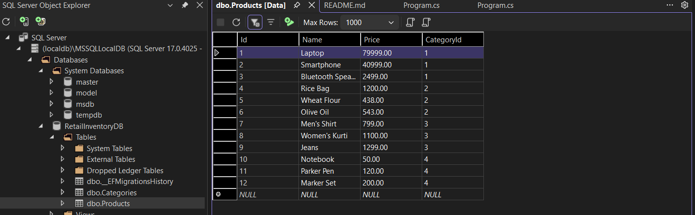
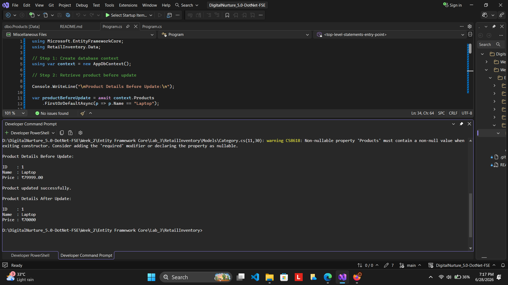
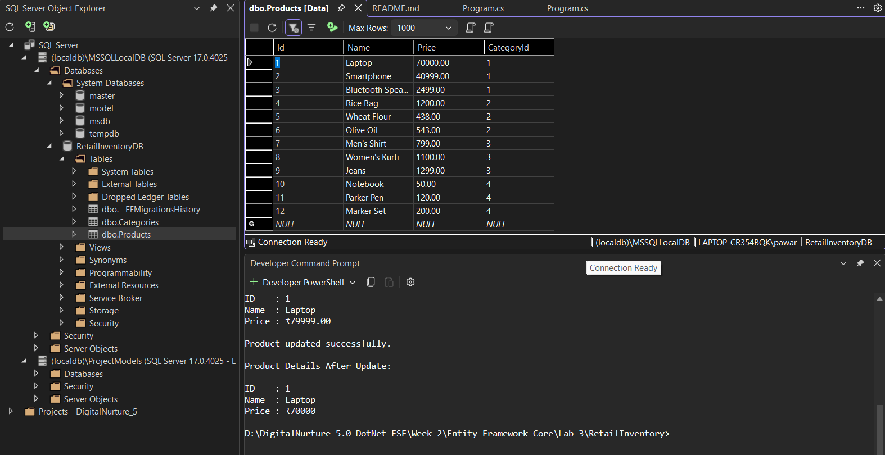
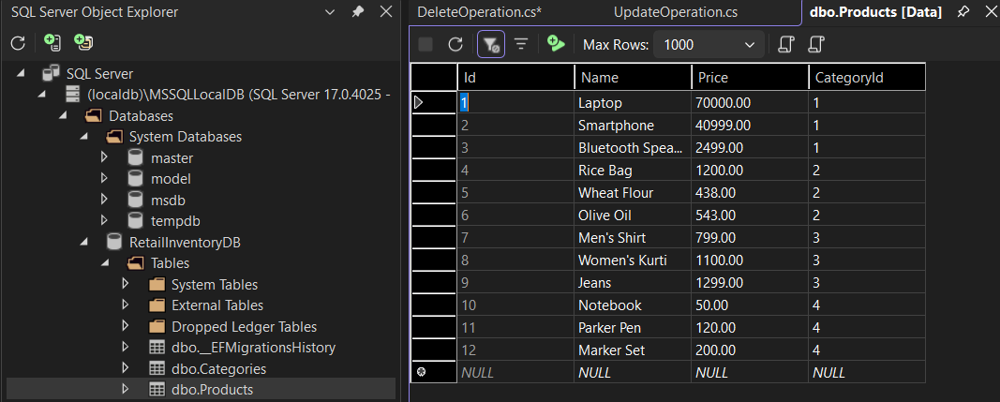
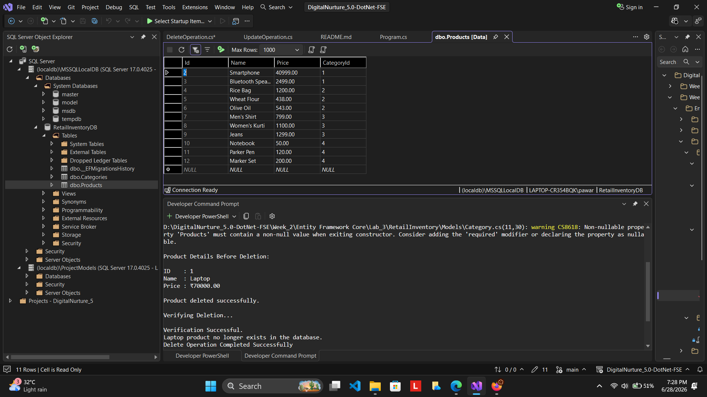
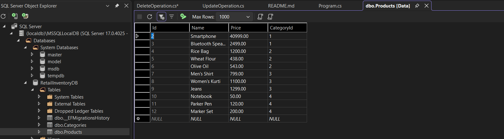

# Lab 6: Updating and Deleting Data Using Entity Framework Core

## Scenario

The Retail Inventory Management System stores product information in a SQL Server database. Over time, product details may need to be modified and obsolete products may need to be removed from the system.

Entity Framework Core provides simple methods to update and delete records while automatically managing the underlying SQL operations.

In this lab, update and delete operations were performed using Entity Framework Core.

## Objective

The objective of this lab is to:

* Update an existing product in the database.
* Delete an existing product from the database.
* Persist changes using `SaveChangesAsync()`.
* Verify the changes in SQL Server.

## Project Structure

This lab was implemented using the same **RetailInventory** project created in **Lab 3**.

The complete project structure, entity classes, database context, migrations, and database configuration were already created in Lab 3 and the database was populated with sample categories and products in Lab 4.

The data retrieval operations performed in Lab 5 were also used as a reference for verifying records before and after modification.

For this lab, two separate files were created:

* `UpdateOperation.cs`
* `DeleteOperation.cs`

These files were used to perform the update and delete operations independently.

Refer to **Lab 3** for the complete project structure and database setup.

Here is the project structure used:

```text
RetailInventory
│
├── Data
│   └── AppDbContext.cs
│
├── Models
│   ├── Product.cs
│   └── Category.cs
│
├── Migrations
│   ├── InitialCreate.cs
│   ├── InitialCreate.Designer.cs
│   └── AppDbContextModelSnapshot.cs
│
├── UpdateOperation.cs
├── DeleteOperation.cs
```

## Implementation Steps - Part A (Update Operation)

### Step 1: Create AppDbContext Object

The program first creates an instance of the database context.

```csharp
using var context = new AppDbContext();
```

This object establishes communication between the application and the database.

### Step 2: Retrieve Product Before Update

The following code retrieves the Laptop product before performing the update operation.

```csharp
var productBeforeUpdate = await context.Products
    .FirstOrDefaultAsync(p => p.Name == "Laptop");
```

### Explanation

* Searches for the product named "Laptop".
* Retrieves the current record from the database.
* Displays the existing product details before modification.

### Step 3: Update the Product

The following code updates the product price.

```csharp
var product = await context.Products
    .FirstOrDefaultAsync(p => p.Name == "Laptop");

if (product != null)
{
    product.Price = 70000;
    await context.SaveChangesAsync();
}
```

### Explanation

* Retrieves the Laptop product.
* Updates the Price property.
* `SaveChangesAsync()` sends the update request to the database.
* Entity Framework Core automatically generates the required SQL UPDATE statement.

### Step 4: Retrieve Product After Update

The following code retrieves the updated record.

```csharp
var productAfterUpdate = await context.Products
    .FirstOrDefaultAsync(p => p.Name == "Laptop");
```

### Explanation

* Retrieves the modified record from the database.
* Displays the updated product information.
* Confirms that the update was successfully saved.

## Implementation Steps - Part B (Delete Operation)

### Step 1: Retrieve Product Before Deletion

The following code retrieves the Laptop product before deletion.

```csharp
var productBeforeDelete = await context.Products
    .FirstOrDefaultAsync(p => p.Name == "Laptop");
```

### Explanation

* Searches for the Laptop product.
* Displays the product details before deletion.
* Confirms that the record exists.

### Step 2: Delete the Product

The following code removes the product from the database.

```csharp
var product = await context.Products
    .FirstOrDefaultAsync(p => p.Name == "Laptop");

if (product != null)
{
    context.Products.Remove(product);
    await context.SaveChangesAsync();
}
```

### Explanation

* Retrieves the Laptop product.
* Marks the entity for deletion.
* `SaveChangesAsync()` permanently removes the record from the database.
* Entity Framework Core automatically generates the required SQL DELETE statement.

### Step 3: Verify Deletion

The following code verifies whether the product still exists.

```csharp
var deletedProduct = await context.Products
    .FirstOrDefaultAsync(p => p.Name == "Laptop");
```

### Explanation

* Searches for the deleted product.
* Returns null if the deletion was successful.
* Confirms that the record no longer exists in the database.

## Execute the Application

Run the application then application displays:

* Product details before update.
* Product details after update.
* Product details before deletion.
* Deletion confirmation message.
* Verification results after deletion.

## Verify the Database

SQL Server Object Explorer was used to verify the database before and after performing the update and delete operations.

The Products table was checked to confirm:

* Product price was updated successfully.
* Product record was deleted successfully.

## Output

Look at the screenshots below:



This screenshot shows:

* Product details before the update operation.
* Original Laptop price stored in the database.



This screenshot shows:

* Successful execution of the update operation.
* Product details before and after modification.
* Confirmation that the update was saved successfully.



This screenshot shows:

* Updated Laptop price stored in the Products table.



This screenshot shows:

* Product record existing before deletion.



This screenshot shows:

* Successful execution of the delete operation.
* Confirmation that the product was removed successfully.
* Verification that the product no longer exists.



This screenshot shows:

* Product record removed from the Products table.
* Verification that deletion was successfully completed.

## Analysis

### Updating Data Using Entity Framework Core

Entity Framework Core tracks changes made to entity objects.

When a property value is modified and `SaveChangesAsync()` is executed:

1. EF Core detects the modified property.
2. Generates an SQL UPDATE statement.
3. Sends the query to SQL Server.
4. Updates the corresponding record in the database.

This allows developers to update database records by simply modifying C# objects.

### Deleting Data Using Entity Framework Core

Entity Framework Core allows records to be removed using the `Remove()` method.

When `SaveChangesAsync()` is executed:

1. EF Core marks the entity for deletion.
2. Generates an SQL DELETE statement.
3. Sends the query to SQL Server.
4. Permanently removes the record from the database.

This simplifies database maintenance operations and eliminates the need for manually writing DELETE queries.

## Result

Thus, update and delete operations were successfully performed on the Retail Inventory database using Entity Framework Core.

The product price was updated successfully, the updated data was verified in SQL Server, and the product was subsequently deleted and verified as removed from the database.
