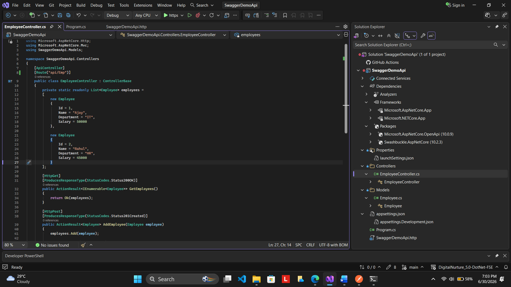
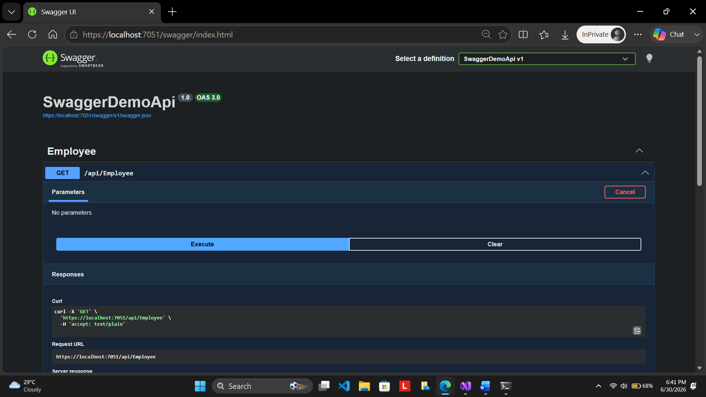
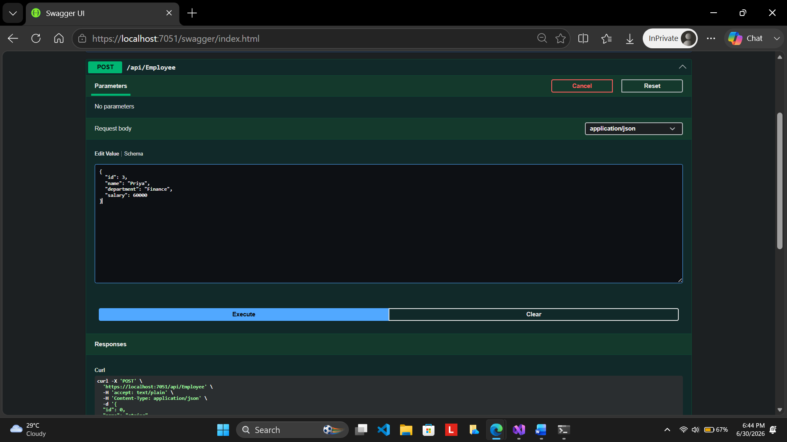
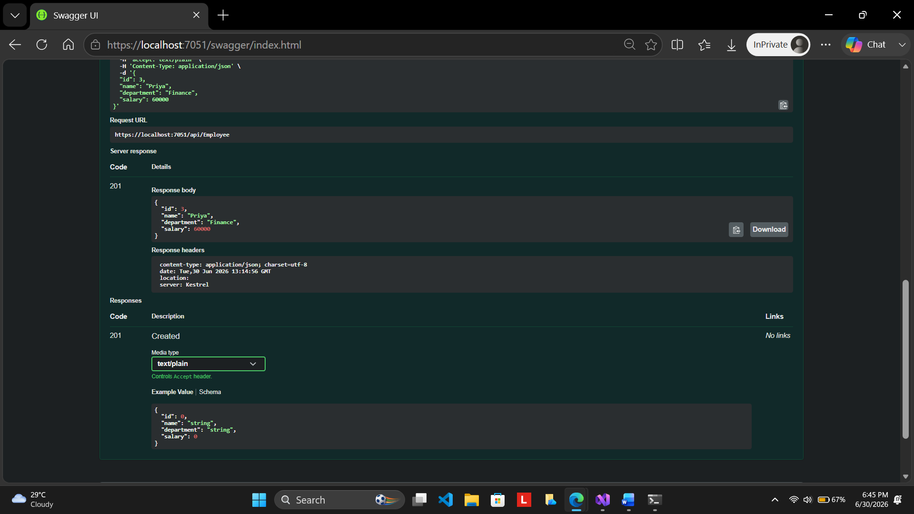
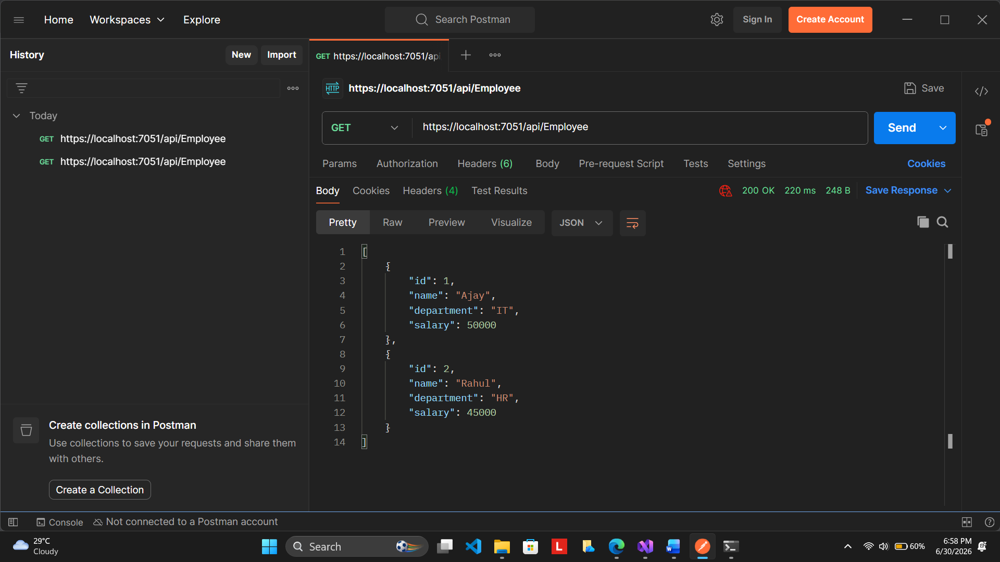
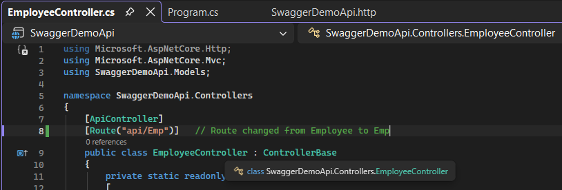
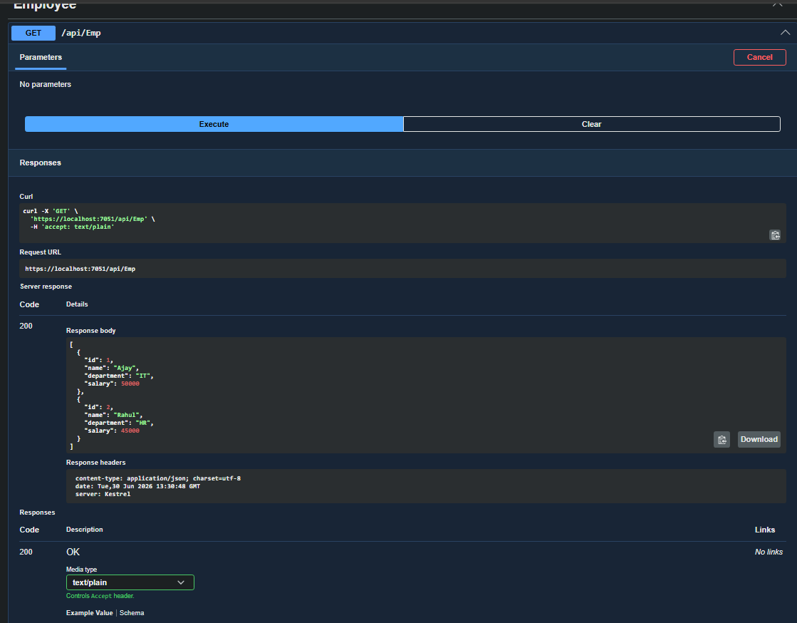

# Exercise 2: ASP.NET Core Web API with Swagger and Postman

## Description

This exercise demonstrates the creation of an ASP.NET Core Web API application using .NET, integration of Swagger for API documentation and testing, implementation of GET and POST operations, testing API endpoints using Swagger UI and Postman, and customization of API routes using the Route attribute.

## Objectives

- Create an ASP.NET Core Web API application.
- Install and configure Swagger using Swashbuckle.AspNetCore.
- Implement GET and POST API endpoints.
- Use ProducesResponseType attributes.
- Test API endpoints using Swagger UI.
- Test API endpoints using Postman.
- Modify controller routing using the Route attribute.
- Verify API accessibility after route modification.

## Project Structure

```text
SwaggerDemoApi
│
├── Controllers
│   └── EmployeeController.cs
│
├── Models
│   └── Employee.cs
│
├── Properties
│   └── launchSettings.json
│
├── Program.cs
│
├── appsettings.json
├── appsettings.Development.json
└── SwaggerDemoApi.http
```

## Implementation Summary

- Created an ASP.NET Core Web API project.
- Installed and configured Swagger using Swashbuckle.AspNetCore.
- Created Employee model and EmployeeController.
- Implemented GET and POST endpoints.
- Added ProducesResponseType attributes for API documentation.
- Tested API endpoints using Swagger UI.
- Tested GET endpoint using Postman.
- Modified controller route from `api/Employee` to `api/Emp`.
- Verified successful API execution after route modification.

## Screenshots

Look at the screenshots below:

### Project Setup



Shows:

- Project structure
- Employee model
- Employee controller implementation

### Swagger GET Request



Shows:

- Swagger UI
- GET endpoint execution
- Employee list response

### Swagger POST Request



Shows:

- POST endpoint request body
- Employee data submission

### Swagger POST Response



Shows:

- Successful POST operation
- HTTP Status Code 201 Created

### Postman GET Request



Shows:

- GET request execution in Postman
- Employee list response
- HTTP Status Code 200 OK

### Route Modification



Shows:

- Route changed from Employee to Emp

### Route Verification



Shows:

- Updated endpoint displayed in Swagger
- Successful API access using `/api/Emp`

## Result

Successfully created and configured an ASP.NET Core Web API application with Swagger. Implemented and tested GET and POST endpoints using Swagger UI and Postman, and verified successful route customization using the Route attribute.
Thus, an ASP.NET Core Web API application was successfully created and configured with Swagger.

Swagger UI was used to explore and test API endpoints, GET and POST operations were implemented successfully, API requests were tested using Postman, and route customization was verified by modifying the controller route from `Employee` to `Emp`.