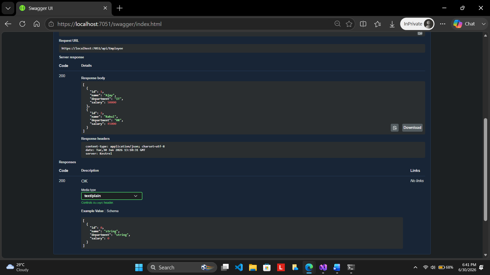

# Exercise 2: ASP.NET Core Web API with Swagger and Postman

## Scenario

Modern web applications expose functionality through APIs that can be consumed by web, mobile, and desktop applications.

ASP.NET Core Web API provides a simple way to build RESTful services, while Swagger helps developers explore, test, and document APIs directly from the browser.

In this exercise, a Web API was created using ASP.NET Core, Swagger was configured for API documentation and testing, API endpoints were tested using both Swagger UI and Postman, and route customization was demonstrated using route attributes.

## Objective

The objective of this exercise is to:

1.  Create an ASP.NET Core Web API application.
2.  Install and configure Swagger using Swashbuckle.AspNetCore.
3.  Expose API endpoints through Swagger UI.
4.  Implement Read and Write operations using HTTP GET and POST methods.
5.  Use `ProducesResponseType` attributes for API response documentation.
6.  Test API endpoints using Swagger UI.
7.  Test API endpoints using Postman.
8.  Modify controller routing using the `Route` attribute.
9.  Verify API accessibility after route modification.

## Project Structure

The following project structure was used for this exercise:

```text
SwaggerDemoApi
│
├── Controllers
│   └── EmployeeController.cs
│
├── Models
│   └── Employee.cs
│
├── Properties
│   └── launchSettings.json
│
├── Program.cs
│
├── appsettings.json
├── appsettings.Development.json
└── SwaggerDemoApi.http
```

## Implementation Steps

### Step 1: Create ASP.NET Core Web API Project

A new ASP.NET Core Web API project was created using the Web API template in Visual Studio Community Edition.

The project generated the default configuration files required for a Web API application.

### Step 2: Install Swagger Package

The following NuGet package was installed:

```powershell
Swashbuckle.AspNetCore
```

This package provides Swagger support for API documentation and testing.

  

### Step 3: Configure Swagger Services

Swagger services were configured inside `Program.cs`.

```csharp
builder.Services.AddEndpointsApiExplorer();

builder.Services.AddSwaggerGen();
```

### Explanation

  `AddEndpointsApiExplorer()` discovers API endpoints.
  `AddSwaggerGen()` generates Swagger documentation.
  Swagger automatically creates API metadata and endpoint definitions.

### Step 4: Configure Swagger Middleware

The Swagger middleware was enabled inside the application pipeline.

```csharp
app.UseSwagger();

app.UseSwaggerUI();
```

### Explanation

  `UseSwagger()` generates the Swagger JSON document.
  `UseSwaggerUI()` provides a browser-based interface for testing APIs.
  Developers can execute requests without external tools.

  

### Step 5: Create Employee Model

A model class named `Employee` was created.

```csharp
public class Employee
{
    public int Id { get; set; }

    public string Name { get; set; }

    public string Department { get; set; }
}
```

### Explanation

The Employee model represents employee information exposed through the API.

### Step 6: Create Employee Controller

An API controller named `EmployeeController` was created.

```csharp
[ApiController]
[Route("api/[controller]")]
public class EmployeeController : ControllerBase
{
}
```

### Explanation

  `ApiController` enables API-specific features.
  `Route` defines the endpoint URL structure.
  Requests are routed to controller action methods.

### Step 7: Implement GET Action

The following GET action was implemented.

```csharp
[HttpGet]
[ProducesResponseType(StatusCodes.Status200OK)]
public IActionResult GetEmployees()
{
    return Ok(employees);
}
```

### Explanation

  Returns a list of employees.
  Produces HTTP Status Code 200.
  Documents the response in Swagger.

  

### Step 8: Implement POST Action

The following POST action was implemented.

```csharp
[HttpPost]
[ProducesResponseType(StatusCodes.Status201Created)]
public IActionResult AddEmployee(Employee employee)
{
    employees.Add(employee);

    return Created("", employee);
}
```

### Explanation

  Accepts employee information through the request body.
  Adds a new employee to the collection.
  Returns HTTP Status Code 201 Created.

  

### Step 9: Test API Using Swagger UI

The application was executed and Swagger UI was opened using:

```text
https://localhost:<port>/swagger
```

The following actions were verified:

  GET endpoint listing.
  POST endpoint listing.
  Request execution using Try It Out.
  API response generation.
  HTTP response codes. 

### Step 10: Test API Using Postman

Postman was used to test the API.

GET Request URL:

```text
https://localhost:<port>/api/Employee
```

The following were verified:

  Employee data returned successfully.
  Response body displayed correctly.
  HTTP Status Code 200 OK received.

  

### Step 11: Modify Controller Route

The controller route was modified.

Before:

```csharp
[Route("api/[controller]")]
```

After:

```csharp
[Route("api/Emp")]
```

### Explanation

  Custom route names can be defined.
  User-friendly endpoint URLs can be exposed.
  API consumers can access shorter endpoint names.

  

### Step 12: Verify Modified Route

The modified endpoint was tested using:

```text
https://localhost:<port>/api/Emp
```

Verification was performed using Swagger UI and Postman.

The API responded successfully after route modification.

## ActionName Attribute

ASP.NET Core allows multiple methods to use the same HTTP verb when different action names are provided.

Example:

```csharp
[HttpGet]
[ActionName("GetAllEmployees")]
public IActionResult GetEmployees()
{
    return Ok();
}
```

### Benefits

  Improves API readability.
  Provides meaningful operation names.
  Helps differentiate actions using the same HTTP verb.

Although ActionName was discussed as part of the exercise objectives, no additional implementation was required for this exercise.

## Output

Look at the screenshots below:

### Project Structure and Controller Implementation


This screenshot shows:

  Complete project structure.
  Employee model creation.
  Employee controller implementation.
  Controller action methods.

### Swagger GET Request



This screenshot shows:

  Swagger UI displaying API endpoints.
  GET request execution.
  Employee list retrieval.

  

### Swagger POST Request


This screenshot shows:

  POST endpoint execution.
  JSON request body.
  Employee data submission.

### Swagger POST Response


This screenshot shows:

  Successful POST operation.
  HTTP Status Code 201 Created.
  Created employee information returned.


### Postman GET Request


This screenshot shows:

  GET request executed through Postman.
  Employee list returned successfully.
  HTTP Status Code 200 OK.

### Route Modification


This screenshot shows:

  Controller route modified from Employee to Emp.
  Custom route configuration.


### Swagger Verification After Route Change


This screenshot shows:

  Updated API endpoint using Emp route.
  Successful endpoint access after route modification.
  
## Analysis

### Swagger Integration

Swagger simplifies API development by providing:

1. Automatic API documentation.
2. Interactive endpoint testing.
3. Response status code documentation.
4. Request and response visualization.

Developers can test APIs directly from the browser without writing additional client applications.

  

### ProducesResponseType Usage

The `ProducesResponseType` attribute documents API responses.

Example:

```csharp
[ProducesResponseType(StatusCodes.Status200OK)]
```

Benefits include:

  Improved Swagger documentation.
  Better API discoverability.
  Clear response expectations for consumers.

### Route Attribute Usage

The Route attribute defines how requests reach controller actions.

Example:

```csharp
[Route("api/Emp")]
```

Benefits include:

  Cleaner endpoint URLs.
  Better API organization.
  User-friendly naming conventions.

  

### Postman Usage

Postman is a widely used API testing tool.

It allows developers to:

  Send GET, POST, PUT, and DELETE requests.
  Inspect response bodies.
  Verify status codes.
  Test request headers and JSON payloads.
  Organize requests into collections.

## Result
# Exercise 2: ASP.NET Core Web API with Swagger and Postman

## Description

This exercise demonstrates the creation of an ASP.NET Core Web API application using .NET, integration of Swagger for API documentation and testing, implementation of GET and POST operations, testing API endpoints using Swagger UI and Postman, and customization of API routes using the Route attribute.

## Objectives

- Create an ASP.NET Core Web API application.
- Install and configure Swagger using Swashbuckle.AspNetCore.
- Implement GET and POST API endpoints.
- Use ProducesResponseType attributes.
- Test API endpoints using Swagger UI.
- Test API endpoints using Postman.
- Modify controller routing using the Route attribute.
- Verify API accessibility after route modification.

## Project Structure

```text
SwaggerDemoApi
│
├── Controllers
│   └── EmployeeController.cs
│
├── Models
│   └── Employee.cs
│
├── Properties
│   └── launchSettings.json
│
├── Program.cs
│
├── appsettings.json
├── appsettings.Development.json
└── SwaggerDemoApi.http
```

## Implementation Summary

- Created an ASP.NET Core Web API project.
- Installed and configured Swagger using Swashbuckle.AspNetCore.
- Created Employee model and EmployeeController.
- Implemented GET and POST endpoints.
- Added ProducesResponseType attributes for API documentation.
- Tested API endpoints using Swagger UI.
- Tested GET endpoint using Postman.
- Modified controller route from `api/Employee` to `api/Emp`.
- Verified successful API execution after route modification.

## Screenshots

Look at the screenshots below:

### Project Setup


Shows:

- Project structure
- Employee model
- Employee controller implementation

### Swagger GET Request


Shows:

- Swagger UI
- GET endpoint execution
- Employee list response

### Swagger POST Request


Shows:

- POST endpoint request body
- Employee data submission

### Swagger POST Response


Shows:

- Successful POST operation
- HTTP Status Code 201 Created

### Postman GET Request


Shows:

- GET request execution in Postman
- Employee list response
- HTTP Status Code 200 OK

### Route Modification


Shows:

- Route changed from Employee to Emp

### Route Verification


Shows:

- Updated endpoint displayed in Swagger
- Successful API access using `/api/Emp`

## Result

Successfully created and configured an ASP.NET Core Web API application with Swagger. Implemented and tested GET and POST endpoints using Swagger UI and Postman, and verified successful route customization using the Route attribute.
Thus, an ASP.NET Core Web API application was successfully created and configured with Swagger.

Swagger UI was used to explore and test API endpoints, GET and POST operations were implemented successfully, API requests were tested using Postman, and route customization was verified by modifying the controller route from `Employee` to `Emp`.