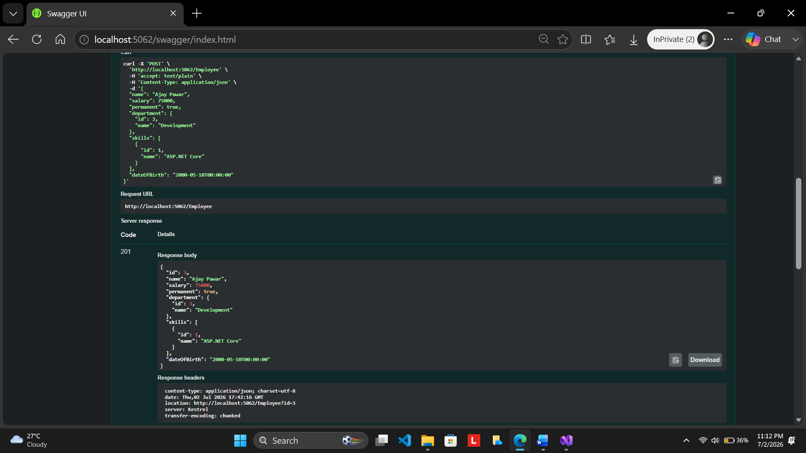
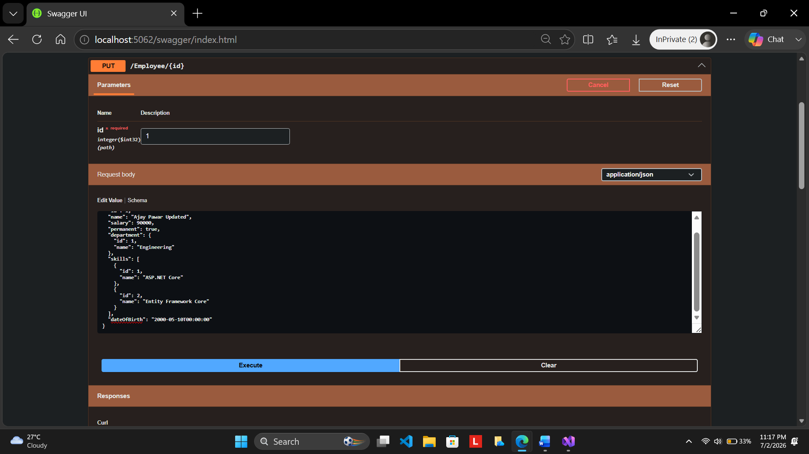
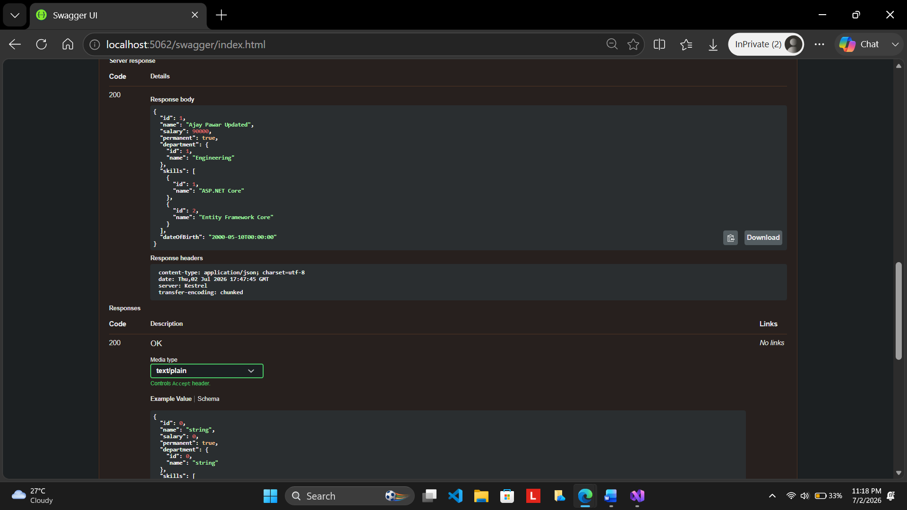
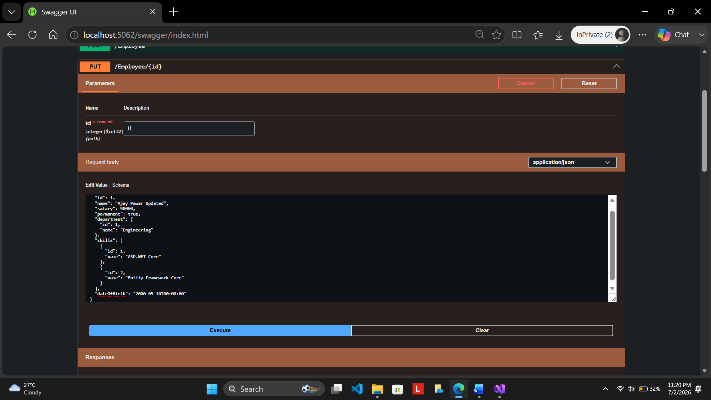
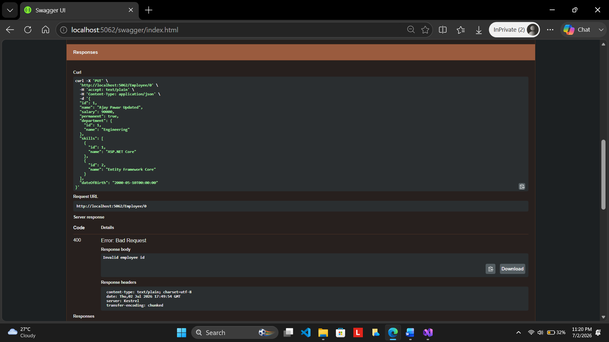
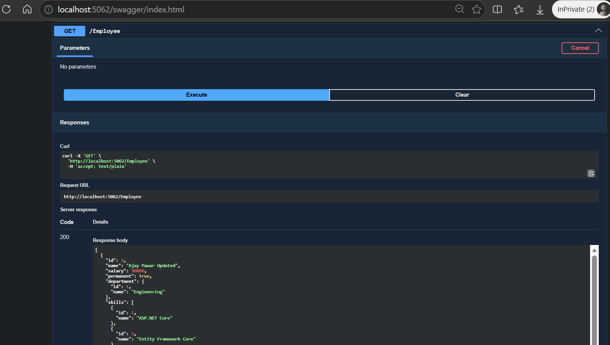

# Web API Handson 4 – CRUD Operations using ASP.NET Core Web API

## Objective

This handson demonstrates Create, Read, Update, and Delete (CRUD) operations using ASP.NET Core Web API. The implementation focuses on updating employee information through the HTTP PUT action method, validating employee IDs, reading request data using the `[FromBody]` attribute, and testing the API using Swagger.

## Project Structure

```text
4.WebApi_Handson/
│
├── EmployeeManagementApi/
│   ├── Controllers/
│   │   └── EmployeeController.cs
│   ├── Filters/
│   │   ├── CustomAuthFilter.cs
│   │   └── CustomExceptionFilter.cs
│   ├── Models/
│   │   ├── Employee.cs
│   │   ├── Department.cs
│   │   └── Skill.cs
│   ├── Program.cs
│   └── ...
│
├── Screenshots/
│   ├── post_request.png
│   ├── put_request.png
│   ├── put_response.png
│   ├── invalid_id_zero.png
│   ├── invalid_id_notfound.png
│   └── get_updated_employee.png
│
└── README.md
```

## Features Implemented

- GET Employee API
- POST Employee API
- PUT Employee API
- DELETE Employee API
- Employee ID validation
- Reading request data using the `[FromBody]` attribute
- Returning updated employee information
- Proper BadRequest responses for invalid employee IDs
- Swagger integration for API testing

## Implementation Summary

### GET Employee

Returns the complete list of employees stored in the in-memory collection.

**HTTP Method**

```
GET
```

**Response**

- 200 OK

### POST Employee

Creates a new employee using the JSON request body.

**HTTP Method**

```
POST
```

**Response**

- 201 Created

### PUT Employee

Updates an existing employee based on the employee ID supplied in the URL.

The action method:

- Accepts employee data using the `[FromBody]` attribute.
- Validates the employee ID.
- Updates the matching employee.
- Returns the updated employee object.

**HTTP Method**

```
PUT
```

**Responses**

- 200 OK
- 400 Bad Request

### DELETE Employee

Deletes an employee from the in-memory employee collection.

**HTTP Method**

```
DELETE
```

**Response**

- 200 OK

## Validation Logic

The PUT action validates the employee ID before performing the update.

Validation performed:

- Employee ID must be greater than zero.
- Employee ID must exist in the employee collection.

If validation fails, the API returns:

```
Invalid employee id
```

with HTTP Status Code **400 Bad Request**.

## Testing using Swagger

The application was successfully tested using Swagger UI.

The following operations were verified:

- Retrieve employee list using GET.
- Create a new employee using POST.
- Update an employee using PUT.
- Validate invalid employee ID (0).
- Validate employee ID not found.
- Retrieve the updated employee using GET.

## Screenshots

### POST Request

Shows the POST request executed through Swagger.



### PUT Request

Shows the PUT request used to update an existing employee.



### PUT Response

Displays the updated employee object returned after a successful update.



### Invalid Employee ID (Zero)

Shows the Bad Request response when the employee ID is less than or equal to zero.



### Employee Not Found

Shows the Bad Request response when a non-existing employee ID is supplied.



### GET Updated Employee

Displays the updated employee data retrieved using the GET endpoint after the update operation.



## Learning Outcomes

After completing this handson, the following concepts were understood:

- Creating CRUD APIs using ASP.NET Core Web API.
- Using the `[FromBody]` attribute to bind JSON request data to model objects.
- Updating objects stored in an in-memory collection.
- Returning `ActionResult<T>` from controller action methods.
- Performing input validation before updating data.
- Returning appropriate HTTP status codes for successful and invalid requests.
- Testing REST APIs using Swagger UI.
- Implementing a complete CRUD workflow in ASP.NET Core Web API.