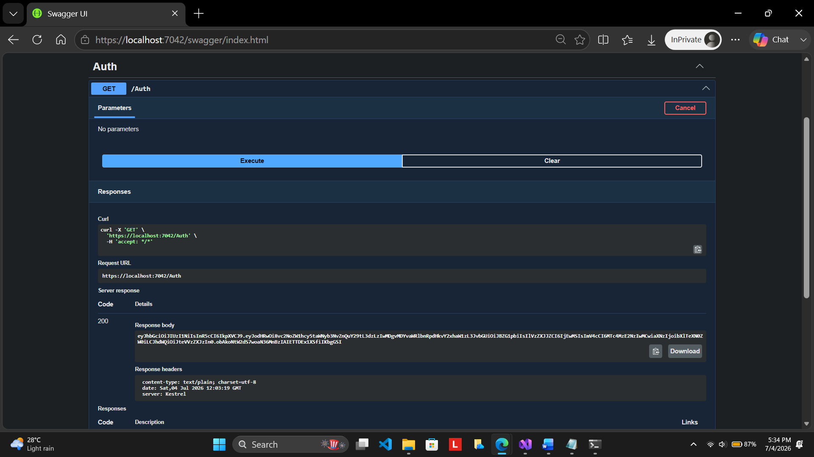
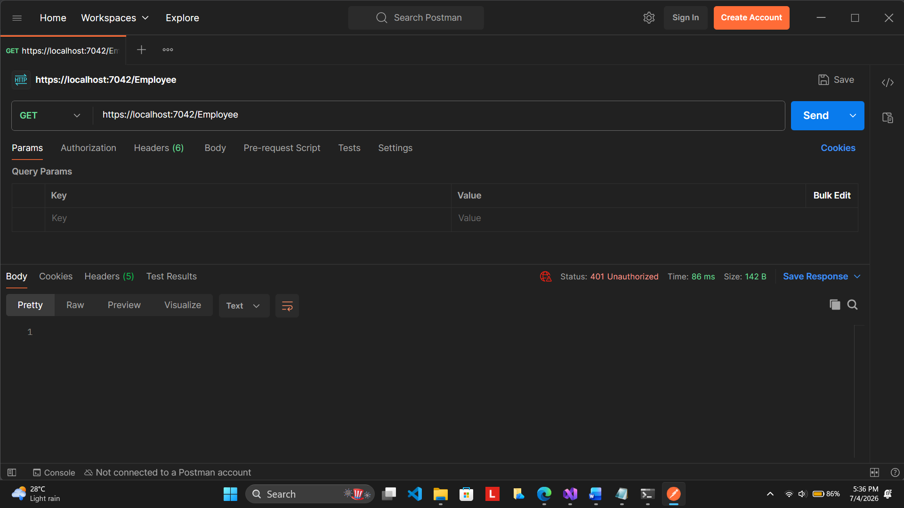
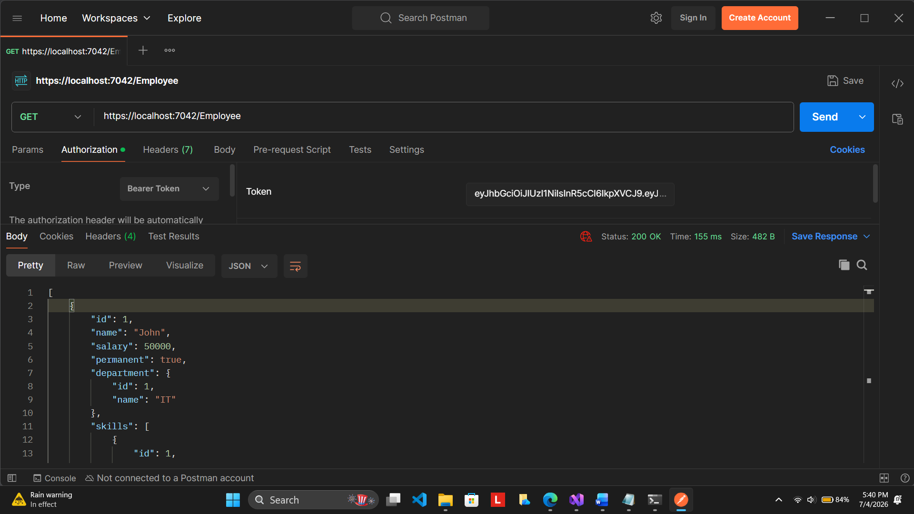
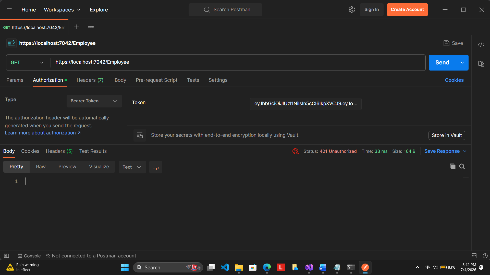
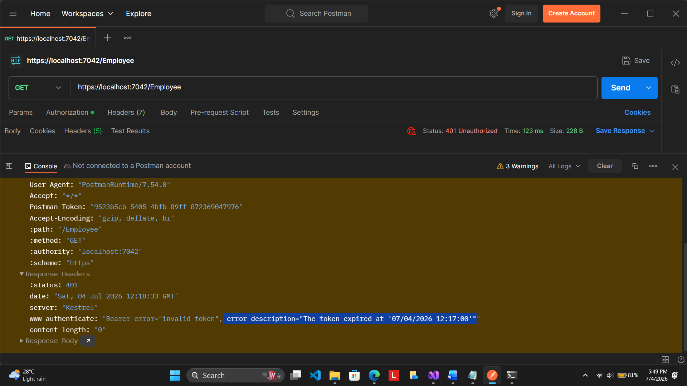
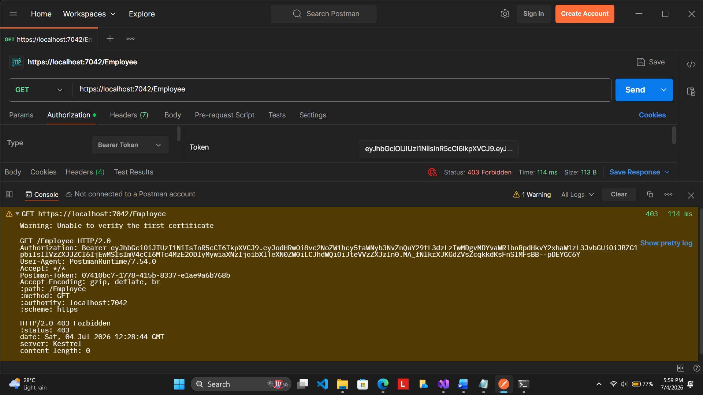
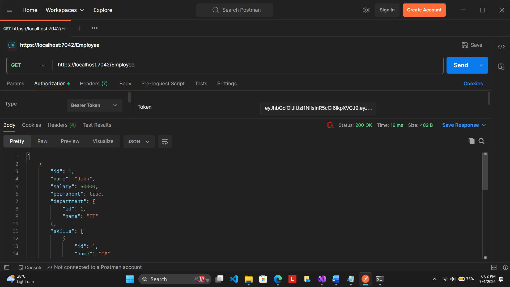

# WebAPI Handson 5 – CORS and JWT Authentication

## Objective

The objective of this handson is to implement JWT (JSON Web Token) based authentication and authorization in an ASP.NET Core Web API application. The application demonstrates how to secure Web API endpoints using bearer tokens, configure Cross-Origin Resource Sharing (CORS), generate JWT tokens, validate authenticated requests, verify token expiration, and implement role-based authorization using the Authorize attribute.

## Project Structure

```text
5.WebApi_Handson
│
├── EmployeeJwtApi
│   ├── Controllers
│   │   ├── AuthController.cs
│   │   └── EmployeeController.cs
│   │
│   ├── Models
│   │   ├── Department.cs
│   │   ├── Employee.cs
│   │   ├── Skill.cs
│   │   └── User.cs
│   │
│   ├── Program.cs
│   └── EmployeeJwtApi.csproj
│
├── Screenshots
└── README.md
```

## Implementation

A new ASP.NET Core Web API project named **EmployeeJwtApi** was created using the Web API template.

JWT authentication was configured in **Program.cs** by adding the JWT Bearer authentication middleware. A symmetric security key, issuer, audience and token validation parameters were configured so that every incoming bearer token is validated before accessing protected endpoints.

Cross-Origin Resource Sharing (CORS) was enabled to allow requests from local applications during development.

Swagger was configured to test all Web API endpoints directly from the browser.

An **AuthController** was created with the **AllowAnonymous** attribute. This controller generates a JWT token containing the UserId and Role claims. The generated token is returned to the client and is later used to authenticate requests made to protected endpoints.

An **EmployeeController** was created and protected using the **Authorize** attribute. Only authenticated users with the required roles are allowed to access the Employee API.

JWT expiration was demonstrated by reducing the token validity period and verifying that expired tokens are rejected with an unauthorized response.

Role-based authorization was demonstrated by modifying the allowed roles in the Authorize attribute and verifying access using different role configurations.

## Testing

### JWT Token Generation

The **AuthController** endpoint was executed using Swagger. A valid JWT token was generated successfully and returned with HTTP Status Code **200 OK**.



### Unauthorized Request Without Token

The Employee API was accessed through Postman without providing an Authorization header. Since no JWT token was supplied, the API rejected the request and returned **401 Unauthorized**.



### Authorized Request Using Valid JWT

The JWT token generated by the AuthController was supplied in the Authorization header as a Bearer token. The Employee API validated the token successfully and returned the employee data with **200 OK**.



### Invalid JWT Token

The JWT token was modified before sending the request. Since the signature validation failed, the API returned **401 Unauthorized**.



### Expired JWT Token

The token expiration time was reduced to two minutes. After waiting for the token to expire, the same request was executed again. The API rejected the expired token and returned **401 Unauthorized**.



### Role Based Authorization Failure

The EmployeeController was configured with only the **POC** role while the generated JWT contained the **Admin** role. Since the authenticated user did not satisfy the required role, access was denied.



### Role Based Authorization Success

The Authorize attribute was updated to allow both **Admin** and **POC** roles. The JWT token containing the **Admin** role was accepted successfully and the Employee API returned the employee list with **200 OK**.



## Concepts Demonstrated

JWT authentication was implemented to secure Web API endpoints.

Bearer token authentication was configured using the JWT Bearer middleware.

Cross-Origin Resource Sharing (CORS) was enabled for local client applications.

The AllowAnonymous attribute was used to expose the authentication endpoint.

The Authorize attribute was used to protect the Employee API.

Claims were included inside the JWT token to store the UserId and Role information.

JWT expiration was verified by generating a short-lived token.

Role-based authorization was demonstrated using different role combinations.

Swagger was used for API testing and JWT generation.

Postman was used to validate authenticated and unauthenticated API requests.

## Result

The Web API application was successfully secured using JWT Bearer Authentication. Token generation, authentication, authorization, token expiration, and role-based authorization were implemented and verified successfully using Swagger and Postman. All objectives specified in the handson were completed successfully.