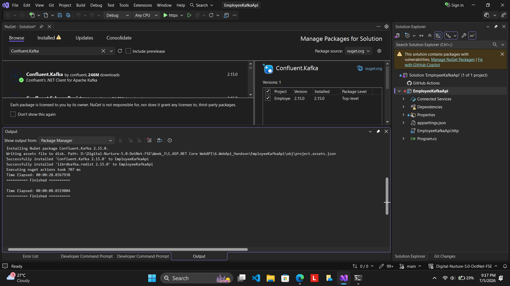
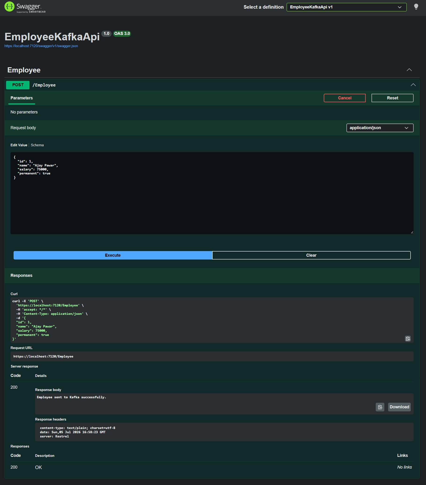
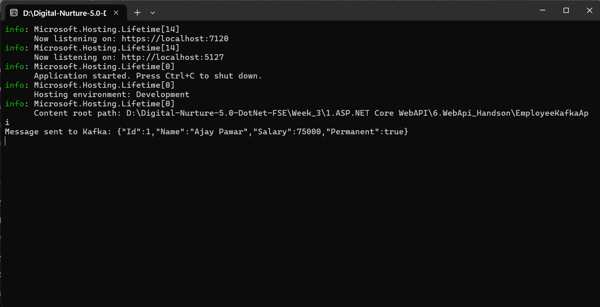
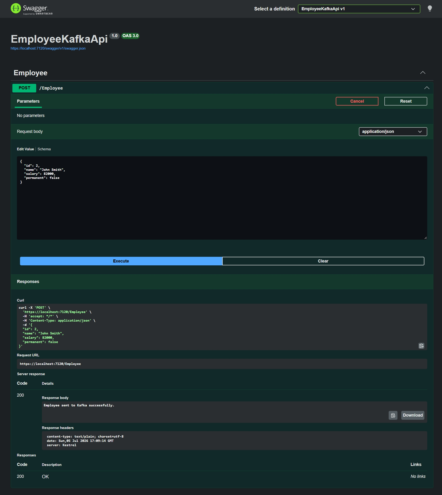
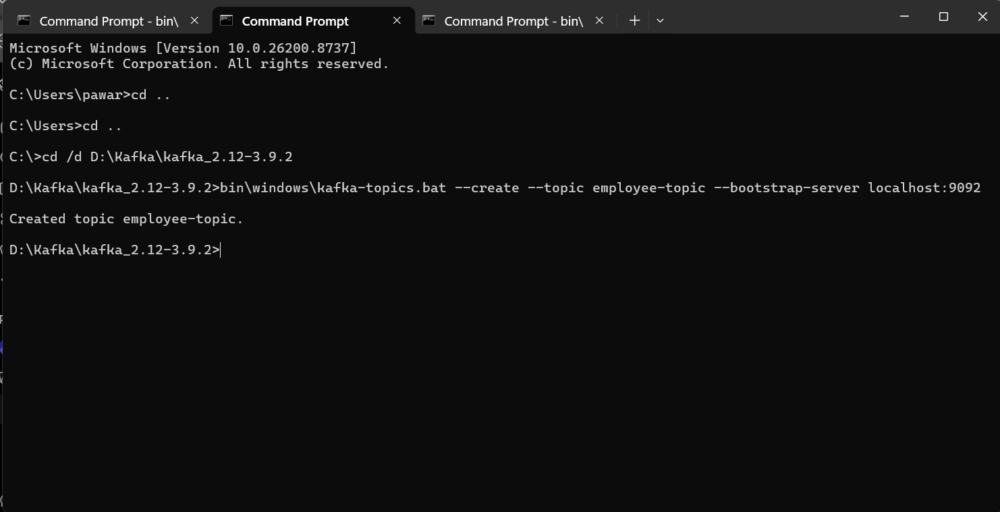
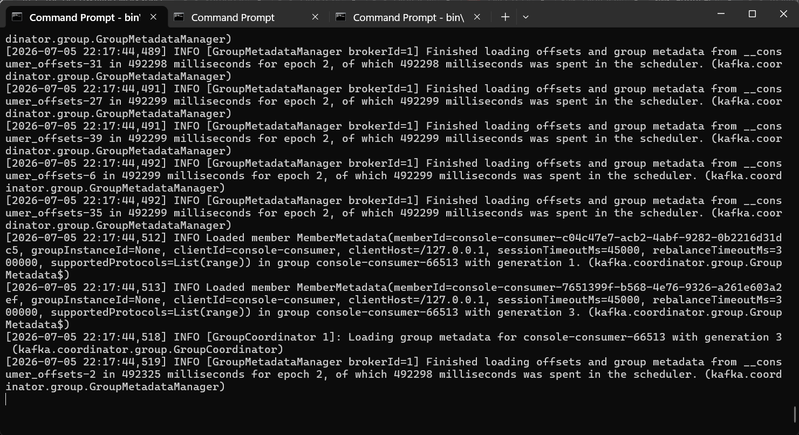

# Web API Handson 6 – Apache Kafka Integration with ASP.NET Core Web API

## Objective

The objective of this handson is to demonstrate integration between an ASP.NET Core Web API application and Apache Kafka using the Confluent.Kafka library. The application publishes employee data as Kafka messages to a Kafka topic, while a Kafka consumer receives and displays the published messages.

## Project Structure

```text
6.WebApi_Handson
│
├── EmployeeKafkaApi
│   ├── Controllers
│   ├── Models
│   ├── Services
│   ├── Program.cs
│   └── EmployeeKafkaApi.csproj
│
├── Kafka
│
├── Screenshots
│
└── README.md
```

## Implementation Steps

### Step 1

Created an ASP.NET Core Web API project named **EmployeeKafkaApi**.

### Step 2

Installed the **Confluent.Kafka** NuGet package to enable communication with the Apache Kafka broker.

### Step 3

Created an `Employee` model to represent the employee data that will be published as Kafka messages.

### Step 4

Implemented the `IKafkaProducerService` interface and `KafkaProducerService` class to publish serialized employee objects to the Kafka topic named **employee-topic**.

### Step 5

Registered the Kafka producer service using Dependency Injection in `Program.cs`.

### Step 6

Implemented the `EmployeeController` with a POST endpoint that accepts employee details and publishes the message to Kafka.

### Step 7

Started the Kafka broker and created the topic `employee-topic`.

### Step 8

Executed the POST endpoint using Swagger and verified that the employee data was successfully published to Kafka.

### Step 9

Verified the published messages using the Kafka Console Consumer.

## Execution Results

The application successfully publishes employee information from the ASP.NET Core Web API to the Kafka broker.

The Kafka Consumer continuously listens to the `employee-topic` and displays every published employee message.

Multiple employee messages were tested successfully.

## Screenshots

### NuGet Package Installation



### Swagger POST Employee Request



### Kafka Consumer Receiving Message



### Multiple Messages Received by Kafka Consumer



### Kafka Producer Console Output


### Kafka Topic Created Successfully



### Kafka Server Running



## Result

Successfully developed an ASP.NET Core Web API application that integrates with Apache Kafka using the Confluent.Kafka library. Employee information entered through the Web API is serialized and published to the Kafka topic, and the Kafka consumer successfully receives and displays the messages, demonstrating end-to-end message publishing using Apache Kafka.