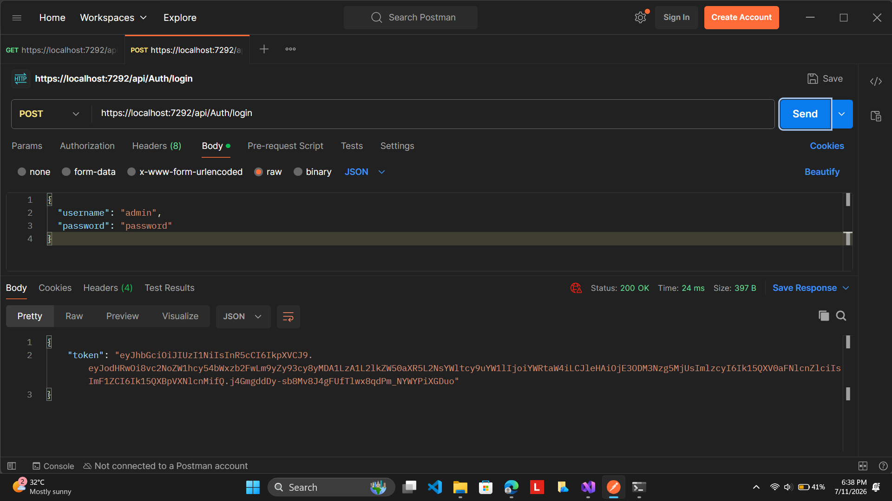
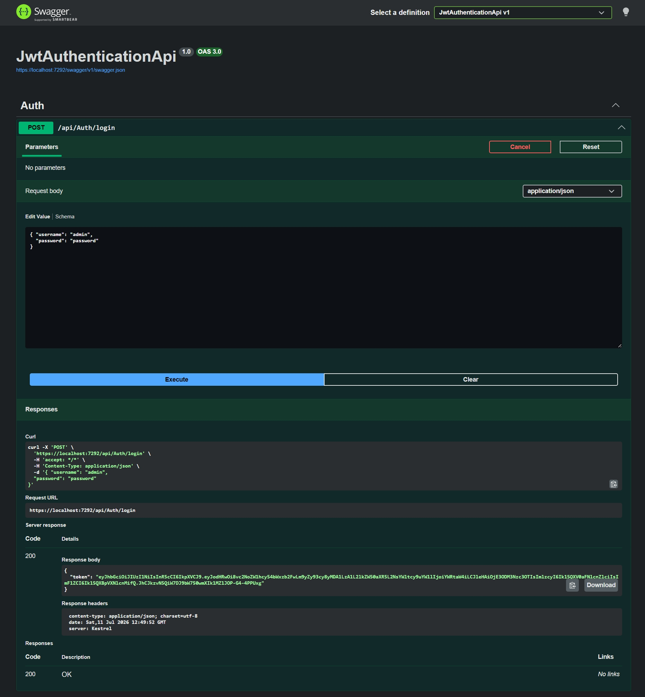
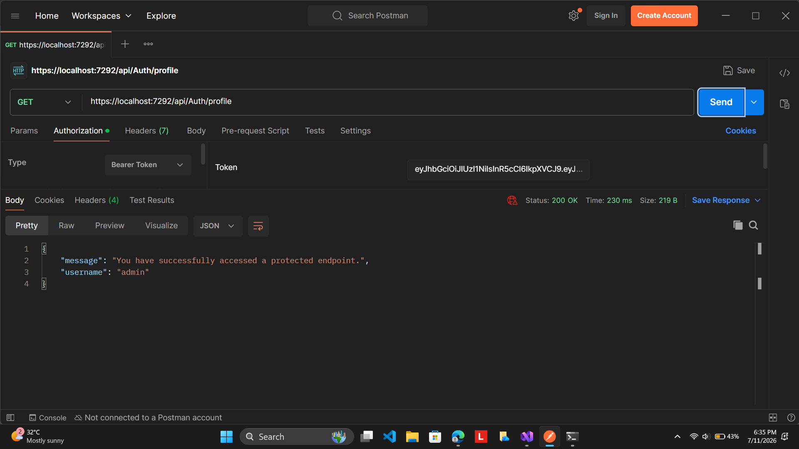

# Question 1: Implement JWT Authentication in ASP.NET Core Web API

## Objective

In this hands-on, I implemented JWT (JSON Web Token) based authentication in an ASP.NET Core Web API. The objective was to create a secure login endpoint that generates a JWT token after successful authentication and to protect API endpoints using the `[Authorize]` attribute.

## Project Structure

```
1.Authentication_Authorization
│
├── JwtAuthenticationApi
│   ├── Controllers
│   │   └── AuthController.cs
│   ├── Models
│   │   └── LoginModel.cs
│   ├── Program.cs
│   ├── appsettings.json
│   └── JwtAuthenticationApi.csproj
│
├── Screenshots
│   ├── authorized_profile_postman.png
│   ├── login_success_token.jpeg
│   └── login_success_token.png
│
└── README.md
```

## Steps Performed

I created a new ASP.NET Core Web API project named **JwtAuthenticationApi**.

I installed the **Microsoft.AspNetCore.Authentication.JwtBearer** NuGet package to enable JWT authentication.

I created a `LoginModel` class to receive the username and password from the client.

I configured the JWT settings inside the `appsettings.json` file by specifying the secret key, issuer, audience, and token expiration duration.

I configured JWT authentication and authorization in `Program.cs` so that the application validates incoming JWT tokens before allowing access to protected endpoints.

I created an `AuthController` containing a login endpoint and a protected profile endpoint.

I implemented user validation using hardcoded credentials (`admin` / `password`) for demonstration purposes.

After successful authentication, I generated a JWT token and returned it in the API response.

I protected the `GET /api/Auth/profile` endpoint using the `[Authorize]` attribute.

I tested the login endpoint using Swagger UI and verified that a JWT token was generated successfully.

Finally, I used Postman to access the protected endpoint by passing the generated JWT token as a Bearer Token in the Authorization header.

## API Endpoints

### Login Endpoint

**POST**

```
/api/Auth/login
```

Sample Request

```json
{
  "username": "admin",
  "password": "password"
}
```

Successful Response

```json
{
  "token": "<Generated JWT Token>"
}
```

### Protected Endpoint

**GET**

```
/api/Auth/profile
```

Authorization Header

```
Authorization: Bearer <Generated JWT Token>
```

Successful Response

```json
{
    "message": "You have successfully accessed a protected endpoint.",
    "username": "admin"
}
```

## Expected Output

The application successfully authenticates the user when valid credentials are provided.

A JWT token is generated after successful authentication.

The protected endpoint can be accessed only by sending a valid JWT token in the Authorization header.

Requests without a valid JWT token are denied access.

## Output

### Successful Login and JWT Token Generation



### Successful Login Response



### Accessing Protected Endpoint using JWT Token



## Conclusion

In this hands-on, I successfully implemented JWT-based authentication in an ASP.NET Core Web API. I configured JWT authentication, generated tokens for authenticated users, and secured API endpoints using the `[Authorize]` attribute. I verified the implementation by testing the login endpoint in Swagger UI and accessing the protected endpoint through Postman using the generated JWT token. This exercise helped me understand how JWT authentication is implemented and used to secure ASP.NET Core Web API microservices.