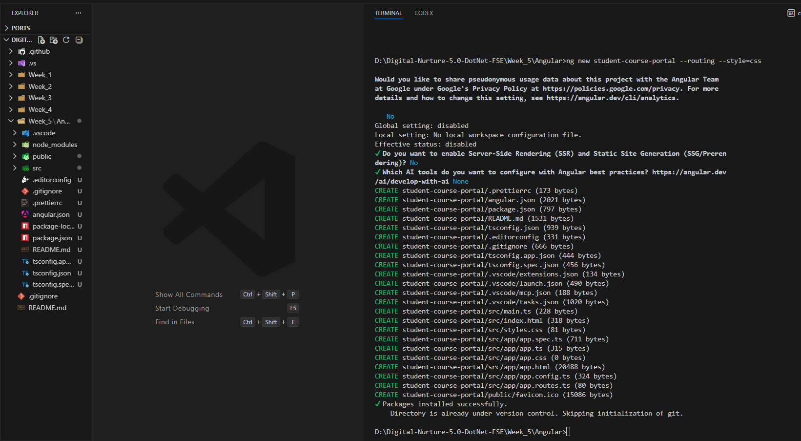
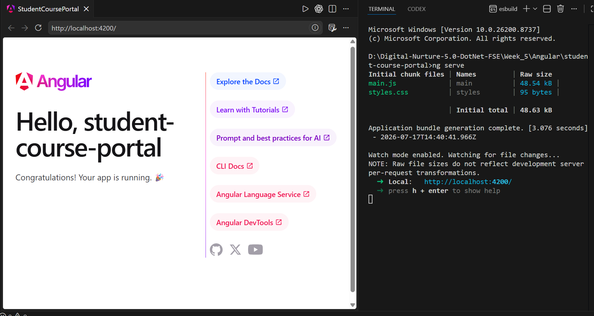
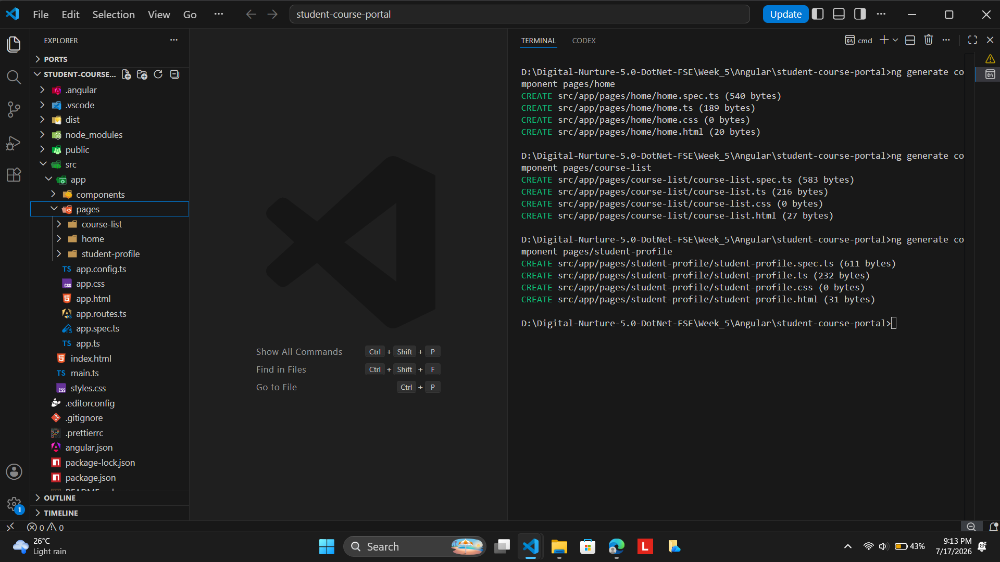
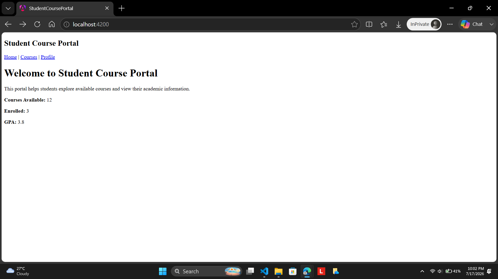
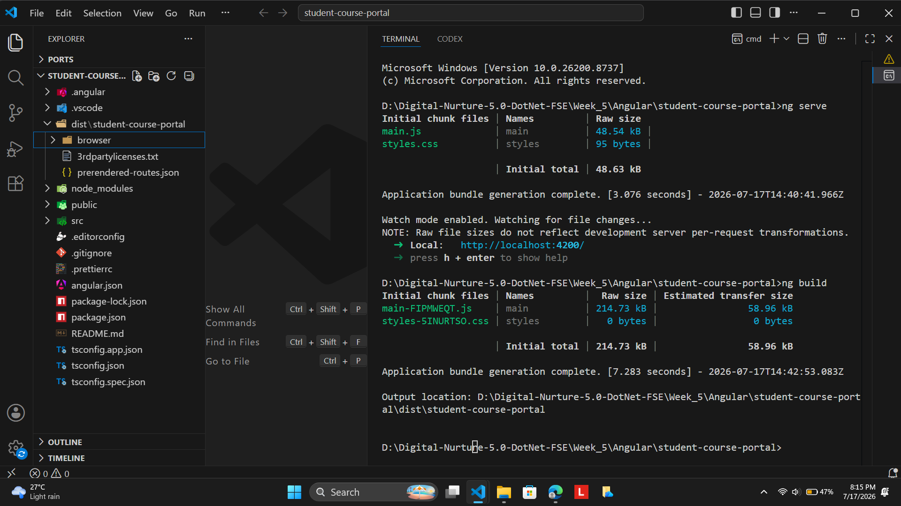

# HANDS-ON 1: Environment Setup, Project Structure & First Component

## 1. Objective

The objective of this hands-on was to set up the Angular development environment, create my first Angular application using Angular CLI, understand the generated project structure, and build the initial Student Course Portal application. I also explored Angular's standalone architecture, routing, components, and production build process to establish a strong foundation for future Angular development.

## 2. Project Structure

```
student-course-portal
│
├── .angular
├── .vscode
├── node_modules
├── public
│   └── favicon.ico
│
├── src
│   ├── app
│   │   ├── header
│   │   │   ├── header.css
│   │   │   ├── header.html
│   │   │   ├── header.spec.ts
│   │   │   └── header.ts
│   │   │
│   │   ├── home
│   │   │   ├── home.css
│   │   │   ├── home.html
│   │   │   ├── home.spec.ts
│   │   │   └── home.ts
│   │   │
│   │   ├── course-list
│   │   │   ├── course-list.css
│   │   │   ├── course-list.html
│   │   │   ├── course-list.spec.ts
│   │   │   └── course-list.ts
│   │   │
│   │   ├── student-profile
│   │   │   ├── student-profile.css
│   │   │   ├── student-profile.html
│   │   │   ├── student-profile.spec.ts
│   │   │   └── student-profile.ts
│   │   │
│   │   ├── app.css
│   │   ├── app.html
│   │   ├── app.spec.ts
│   │   ├── app.ts
│   │   ├── app.config.ts
│   │   └── app.routes.ts
│   │
│   ├── index.html
│   ├── main.ts
│   └── styles.css
│
├── angular.json
├── package.json
├── package-lock.json
├── tsconfig.json
├── tsconfig.app.json
├── tsconfig.spec.json
└── README.md
```

## 3. Task 1: Install Angular CLI and Create the Student Course Portal Project

1. I verified that Node.js and npm were installed successfully on my system.

2. I installed Angular CLI globally using npm so that Angular commands could be executed from any directory.

3. I created a new Angular application named **student-course-portal** using Angular CLI with routing enabled and CSS selected as the stylesheet format.

4. Angular automatically generated the complete project structure, installed all required dependencies, configured TypeScript, and prepared the application for development.

5. I opened the project in Visual Studio Code and explored the generated files and folders to understand the architecture of an Angular application.

6. I executed the application using the **ng serve** command and verified that the default Angular welcome page was displayed successfully in the browser.

## 4. Task 2: Explore the Angular Project Structure

1. I examined the purpose of the generated folders including **src**, **app**, **public**, **node_modules**, and **.angular**.

2. I studied the configuration files including **angular.json**, **package.json**, **tsconfig.json**, **main.ts**, **app.config.ts**, and **app.routes.ts**.

3. I understood how Angular bootstraps the application starting from **main.ts** and how the root App component is loaded.

4. I explored the dependency information stored inside **package.json** and learned how npm manages Angular packages.

5. I reviewed the build configuration present inside **angular.json** and understood how Angular controls development and production builds.

## 5. Task 3: Create the First Components

1. I generated the Header component using Angular CLI.

2. I generated the Home component.

3. I generated the Course List component.

4. I generated the Student Profile component.

5. Angular automatically created the TypeScript, HTML, CSS, and unit testing files for every component.

6. I updated the Header component to display the Student Course Portal title and navigation links.

7. I designed the Home component to display a welcome message along with sample dashboard statistics including available courses, enrolled courses, and GPA.

8. I modified the root App component to display the Header component and Router Outlet.

9. I successfully executed the application and verified that the customized Student Course Portal home page appeared correctly in the browser.

## 6. Expected Output

After completing this hands-on, the application should:

1. Build successfully using Angular CLI.
2. Display the Student Course Portal header.
3. Display the customized Home page.
4. Execute successfully on **http://localhost:4200**.
5. Successfully generate a production build using **ng build**.

## 7. Output

### Project Created



### Angular Default Page



### Project Structure



### Student Course Portal Home Page



### Successful Production Build



## 8. Conclusion

In this hands-on, I successfully configured the Angular development environment and created my first Angular application using Angular CLI. I explored the generated project structure, understood the purpose of the important Angular configuration files, created reusable standalone components, customized the application's home page, and verified both the development server and production build. This hands-on established the foundation required for implementing more advanced Angular concepts in the subsequent exercises.