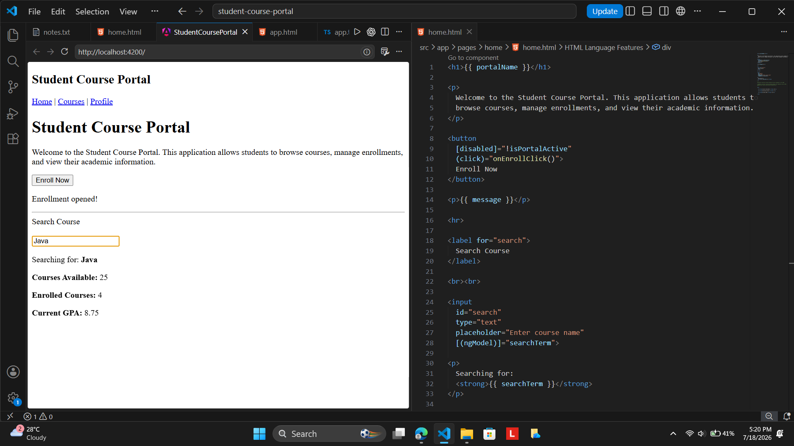
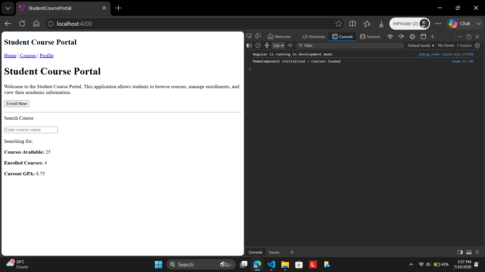
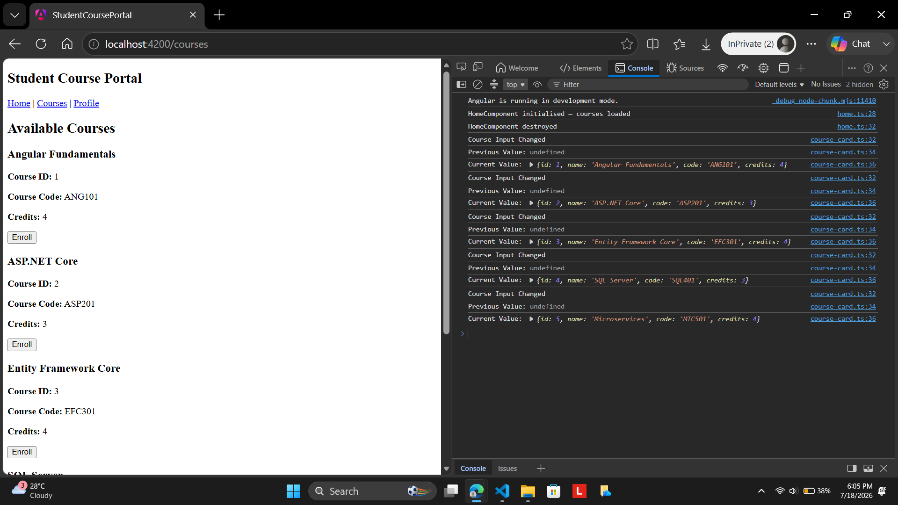
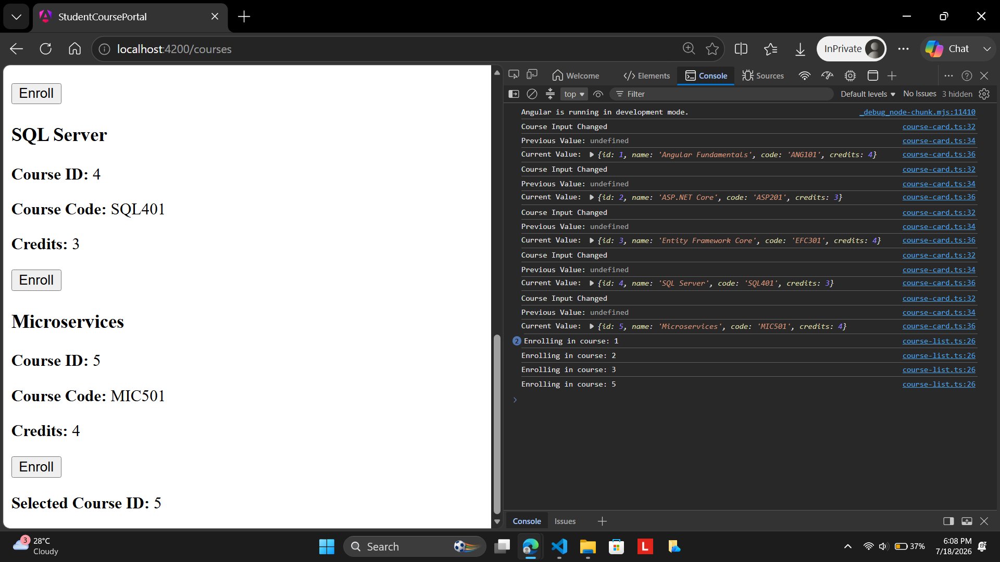

# Angular Hands-On 2 – Data Binding, Lifecycle Hooks & Component Communication

## Objective

The objective of this hands-on was to enhance the Student Course Portal application by implementing Angular's data binding techniques, lifecycle hooks, and parent-child component communication. During this exercise, I learned how to use interpolation, property binding, event binding, and two-way data binding to create dynamic user interfaces. I also implemented Angular lifecycle hooks such as `ngOnInit`, `ngOnChanges`, and `ngOnDestroy` to understand the lifecycle of a component. Finally, I established communication between parent and child components using `@Input`, `@Output`, and `EventEmitter`.

## Project Structure

```
student-course-portal
│
├── src
│   ├── app
│   │   │
│   │   ├── app.config.ts
│   │   ├── app.css
│   │   ├── app.html
│   │   ├── app.routes.ts
│   │   ├── app.spec.ts
│   │   ├── app.ts
│   │   │
│   │   ├── components
│   │   │   ├── header
│   │   │   │   ├── header.ts
│   │   │   │   ├── header.html
│   │   │   │   ├── header.css
│   │   │   │   └── header.spec.ts
│   │   │   │
│   │   │   └── course-card
│   │   │       ├── course-card.ts
│   │   │       ├── course-card.html
│   │   │       ├── course-card.css
│   │   │       └── course-card.spec.ts
│   │   │
│   │   └── pages
│   │       ├── home
│   │       │   ├── home.ts
│   │       │   ├── home.html
│   │       │   ├── home.css
│   │       │   └── home.spec.ts
│   │       │
│   │       ├── course-list
│   │       │   ├── course-list.ts
│   │       │   ├── course-list.html
│   │       │   ├── course-list.css
│   │       │   └── course-list.spec.ts
│   │       │
│   │       └── student-profile
│   │           ├── student-profile.ts
│   │           ├── student-profile.html
│   │           ├── student-profile.css
│   │           └── student-profile.spec.ts
│   │
│   ├── assets
│   ├── index.html
│   ├── main.ts
│   └── styles.css
│
├── angular.json
├── package.json
├── tsconfig.json
└── README.md
```

## Task 1: All Four Binding Types

### Steps Performed

1. I modified the Home component to make the Student Course Portal page dynamic instead of displaying hardcoded content.

2. I declared a `portalName` property in the Home component and displayed its value using Angular string interpolation.

3. I created an `isPortalActive` property and used property binding to control whether the **Enroll Now** button remained enabled or disabled.

4. I implemented an `onEnrollClick()` method and connected it to the button using Angular event binding. When the button was clicked, a confirmation message was displayed on the page.

5. I added an input field for course searching and implemented two-way data binding using `[(ngModel)]`. This allowed the search text entered by the user to be reflected immediately on the page.

6. I imported the `FormsModule` into the standalone Home component so that Angular could recognize and process the `ngModel` directive.

7. I added the required code comment explaining the difference between one-way property binding and two-way binding using `ngModel`.

8. I executed the application and verified that interpolation, property binding, event binding, and two-way binding were all functioning correctly.

## Task 2: Lifecycle Hooks

### Steps Performed

1. I implemented the `OnInit` lifecycle hook inside the Home component.

2. I simulated loading the available course count during component initialization.

3. I logged the message **"HomeComponent initialised — courses loaded"** to the browser console to verify that the initialization process executed successfully.

4. I implemented the `OnDestroy` lifecycle hook to observe when the Home component was removed from the application during navigation.

5. I logged the message **"HomeComponent destroyed"** to the browser console whenever the application navigated away from the Home page.

6. I generated a new reusable `CourseCardComponent` using the Angular CLI.

7. I added an `@Input()` property to the Course Card component to receive course information from its parent component.

8. I implemented the `OnChanges` lifecycle hook and logged both the previous and current values of the course input whenever Angular passed data into the component.

9. I rendered multiple Course Card components and verified that `ngOnChanges()` executed once for every component instance during the initial rendering process.

## Task 3: Parent–Child Communication Using @Input and @Output

### Steps Performed

1. I replaced the generic course input with a strongly typed course object containing the course ID, name, code, and credits.

2. I displayed all course details inside the Course Card component using Angular interpolation.

3. I implemented an `@Output()` property using `EventEmitter<number>` to allow the child component to send events back to its parent.

4. I added an **Enroll** button to every Course Card component.

5. When the Enroll button was clicked, the corresponding course ID was emitted from the child component to the parent component.

6. Inside the Course List component, I created an array containing five different course objects.

7. I displayed all course cards dynamically using the `*ngFor` structural directive instead of manually creating each component.

8. I implemented the `onEnroll()` method in the parent component to receive the emitted course ID.

9. I displayed the selected course ID below the list and logged the enrollment message to the browser console whenever a course was selected.

10. I verified that parent-child communication was working correctly using `@Input`, `@Output`, and `EventEmitter`.

## Expected Output

After completing this hands-on, the Student Course Portal application should:

1. Display dynamic content using Angular interpolation.
2. Enable or disable the Enroll button through property binding.
3. Display a confirmation message using event binding.
4. Update the search text in real time using two-way binding.
5. Execute `ngOnInit`, `ngOnDestroy`, and `ngOnChanges` during the appropriate component lifecycle stages.
6. Display multiple Course Card components using reusable child components.
7. Pass course information from the parent component to the child component using `@Input`.
8. Send enrollment events from the child component back to the parent component using `@Output` and `EventEmitter`.
9. Display the selected course ID after clicking the Enroll button.
10. Log lifecycle events and enrollment actions to the browser console.

## Output

### Task 1 – Data Binding



### Task 2 – Home Component Initialization



### Task 2 – Lifecycle Hooks



### Task 3 – Parent Child Communication



## Conclusion

In this hands-on, I successfully transformed the Student Course Portal into a dynamic Angular application by implementing all four data binding techniques, Angular lifecycle hooks, and parent-child communication. I learned how Angular updates the user interface using data binding, how lifecycle hooks execute during different stages of a component's lifetime, and how components communicate using `@Input`, `@Output`, and `EventEmitter`. This exercise strengthened my understanding of Angular component interaction and provided a solid foundation for developing scalable and maintainable Angular applications.