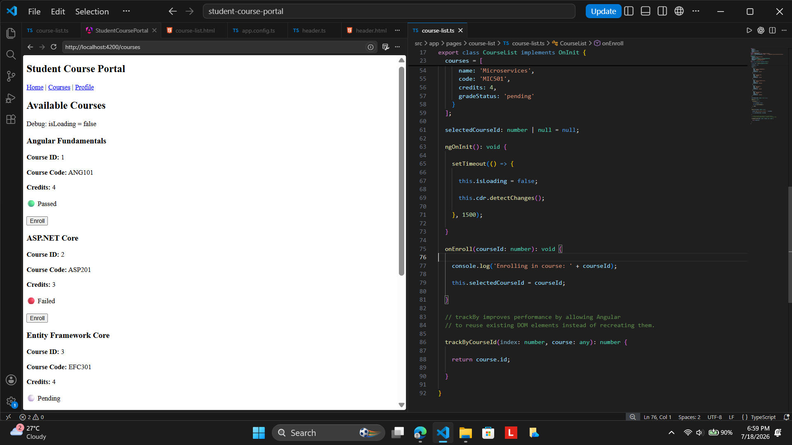
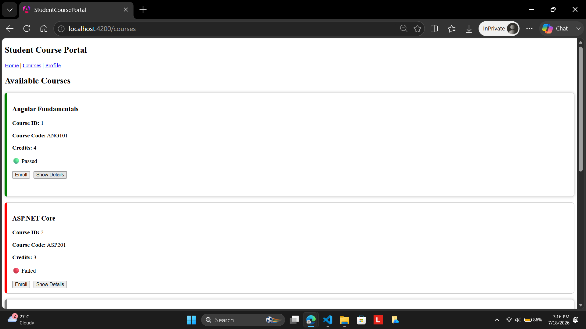
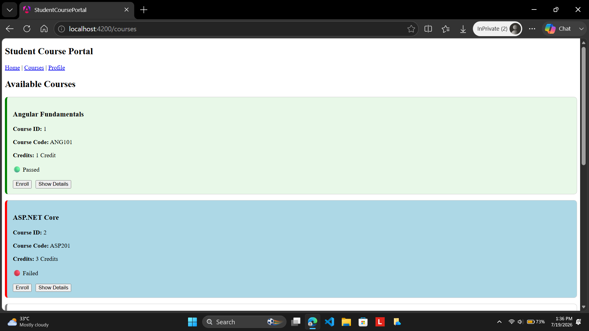

# Hands-On 3: Directives & Pipes – Built-in and Custom

## Objective

The objective of this hands-on was to understand how Angular Directives and Pipes enhance the functionality and presentation of an application. I learned how structural directives dynamically add or remove elements from the DOM, how attribute directives modify the appearance of HTML elements, and how custom directives can be created to implement reusable behaviour. I also implemented a custom pipe to transform displayed data into a more user-friendly format while gaining an understanding of Angular's template rendering process.

## Project Structure

```text
student-course-portal/
│
├── src/
│   └── app/
│       │
│       ├── components/
│       │   ├── header/
│       │   │   ├── header.ts
│       │   │   ├── header.html
│       │   │   ├── header.css
│       │   │   └── header.spec.ts
│       │   │
│       │   └── course-card/
│       │       ├── course-card.ts
│       │       ├── course-card.html
│       │       ├── course-card.css
│       │       └── course-card.spec.ts
│       │
│       ├── directives/
│       │   ├── highlight.ts
│       │   └── highlight.spec.ts
│       │
│       ├── pages/
│       │   ├── home/
│       │   │   ├── home.ts
│       │   │   ├── home.html
│       │   │   ├── home.css
│       │   │   └── home.spec.ts
│       │   │
│       │   ├── course-list/
│       │   │   ├── course-list.ts
│       │   │   ├── course-list.html
│       │   │   ├── course-list.css
│       │   │   └── course-list.spec.ts
│       │   │
│       │   └── student-profile/
│       │       ├── student-profile.ts
│       │       ├── student-profile.html
│       │       ├── student-profile.css
│       │       └── student-profile.spec.ts
│       │
│       ├── pipes/
│       │   ├── credit-label.ts
│       │   └── credit-label.spec.ts
│       │
│       ├── app.ts
│       ├── app.html
│       ├── app.css
│       ├── app.routes.ts
│       └── app.config.ts
│
├── public/
├── angular.json
├── package.json
├── tsconfig.json
└── ...
```

## Task 1: Structural Directives

In this task, I implemented Angular's structural directives to dynamically control how elements were displayed on the page. I introduced a loading state using the `*ngIf` directive and simulated data loading by displaying a loading message for one and a half seconds before rendering the course list. I rendered the available courses dynamically using the `*ngFor` directive together with the `trackBy` function to improve rendering performance. I added a `gradeStatus` property to every course object and used the `*ngSwitch` directive to display different status badges based on each course's completion status. Finally, I implemented an `else` block using `ng-template` to display an appropriate message whenever the course collection becomes empty.

## Task 2: Attribute Directives

In this task, I implemented Angular's built-in attribute directives to dynamically style the course cards. I used `ngClass` to apply different CSS classes depending on whether a course was enrolled or considered a full-credit course. I applied `ngStyle` to dynamically change the left border colour of each course card according to its grade status. I implemented a Show Details button that expanded and collapsed the course card by toggling an additional CSS class. To improve readability and maintainability, I moved the conditional class logic into a getter method inside the component instead of writing complex expressions directly in the HTML template.

## Task 3: Custom Directive and Custom Pipe

In this task, I created a reusable custom attribute directive named `HighlightDirective` to provide hover highlighting functionality for every course card. The directive listened for mouse enter and mouse leave events using `@HostListener` and dynamically changed the card's background colour. I also made the directive configurable by accepting the highlight colour through an `@Input` property. Next, I implemented a reusable custom pipe named `CreditLabelPipe` that transformed numeric credit values into user-friendly labels such as "1 Credit", "4 Credits", and "No Credits" for zero or null values. Finally, I integrated both the custom directive and custom pipe into the Student Course Portal application and verified that they worked correctly.

## Expected Output

After successfully completing this hands-on, the application should:

1. Display a loading message before rendering the course list.
2. Render all course cards dynamically using structural directives.
3. Display different grade badges based on each course's status.
4. Apply dynamic CSS classes and inline styles using Angular attribute directives.
5. Expand and collapse course cards using conditional CSS classes.
6. Highlight course cards when the mouse hovers over them.
7. Display course credits using the custom Credit Label Pipe.
8. Display the selected course ID after clicking the Enroll button.

## Output

### Task 1 – Loading State and Structural Directives




### Task 2 – Attribute Directives



### Task 3 – Highlight Directives


### Task 3 – Custom Directive and Custom Pipe


## Conclusion

Through this hands-on, I developed a comprehensive understanding of Angular Directives and Pipes by implementing both the built-in and custom variations within the Student Course Portal application. I learned how structural directives control the creation and removal of DOM elements, how attribute directives dynamically modify the appearance of existing elements, and how custom directives allow reusable behaviour to be encapsulated into a single component. I also implemented a reusable custom pipe to improve data presentation and gained practical experience in building cleaner, more maintainable, and reusable Angular applications using industry-recommended practices.