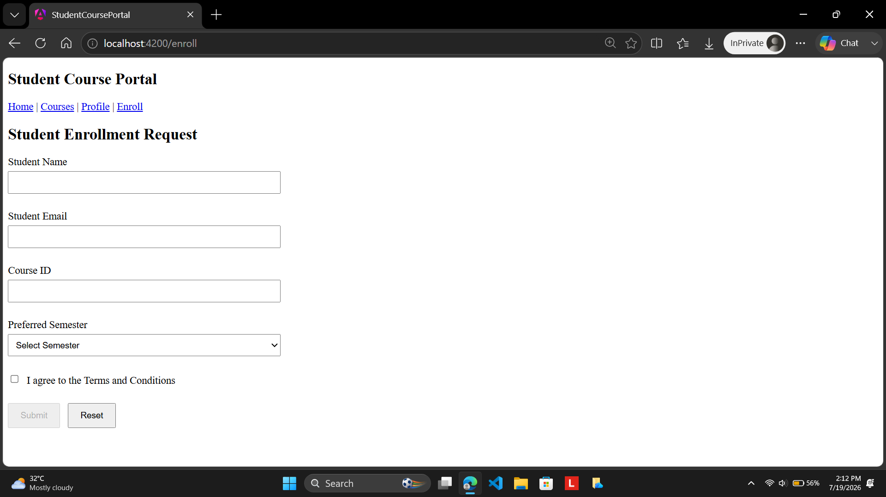
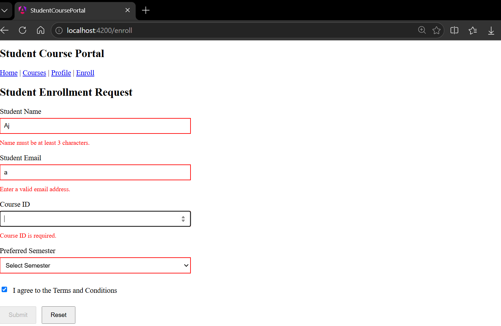
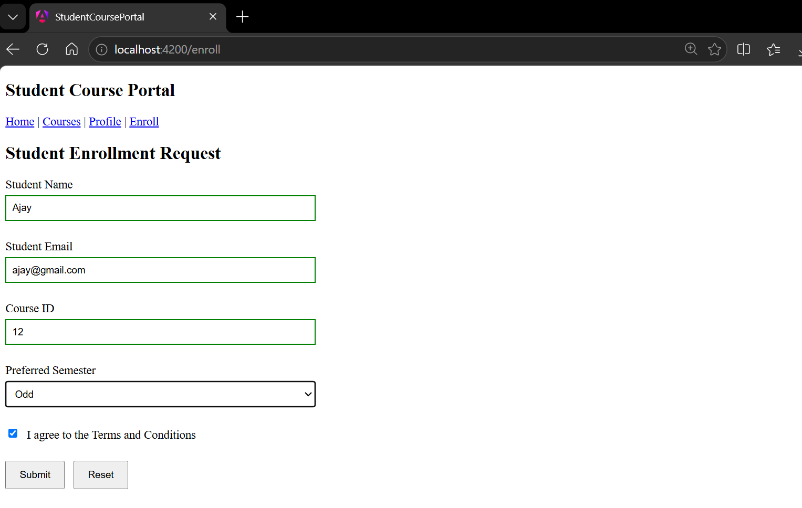
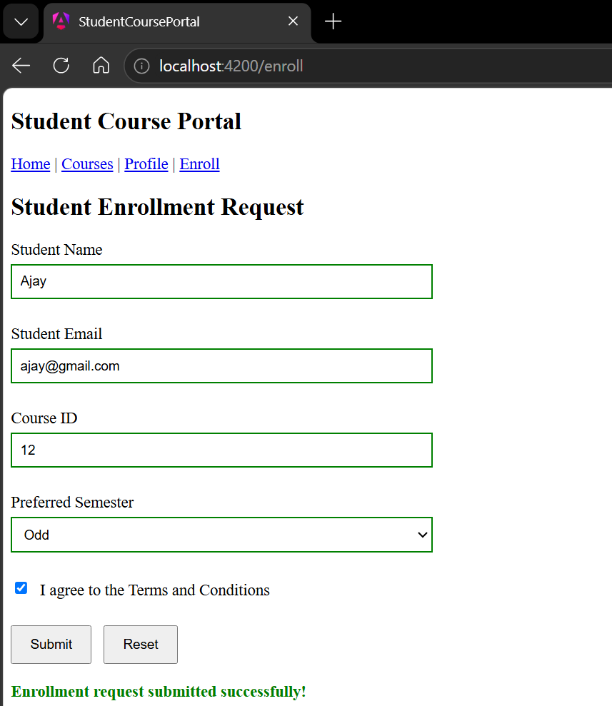

# Hands-On 4: Template-Driven Forms & Validation

## Objective

The objective of this hands-on was to understand how Angular Template-Driven Forms are used to collect, validate, and process user input. I learned how Angular simplifies form development using the `ngForm` and `ngModel` directives while providing built-in validation support. I also implemented contextual validation messages, applied Angular's automatic validation state classes for styling, handled form submission, and reset the form after completion to create a complete Student Enrollment Request form.

## Project Structure

```text
student-course-portal/
│
├── src/
│   └── app/
│       │
│       ├── components/
│       │   ├── header/
│       │   │   ├── header.ts
│       │   │   ├── header.html
│       │   │   ├── header.css
│       │   │   └── header.spec.ts
│       │   │
│       │   └── course-card/
│       │       ├── course-card.ts
│       │       ├── course-card.html
│       │       ├── course-card.css
│       │       └── course-card.spec.ts
│       │
│       ├── directives/
│       │   ├── highlight.ts
│       │   └── highlight.spec.ts
│       │
│       ├── pages/
│       │   ├── home/
│       │   │   ├── home.ts
│       │   │   ├── home.html
│       │   │   ├── home.css
│       │   │   └── home.spec.ts
│       │   │
│       │   ├── course-list/
│       │   │   ├── course-list.ts
│       │   │   ├── course-list.html
│       │   │   ├── course-list.css
│       │   │   └── course-list.spec.ts
│       │   │
│       │   ├── student-profile/
│       │   │   ├── student-profile.ts
│       │   │   ├── student-profile.html
│       │   │   ├── student-profile.css
│       │   │   └── student-profile.spec.ts
│       │   │
│       │   └── enrollment-form/
│       │       ├── enrollment-form.ts
│       │       ├── enrollment-form.html
│       │       ├── enrollment-form.css
│       │       └── enrollment-form.spec.ts
│       │
│       ├── directives/
│       ├── pipes/
│       ├── app.ts
│       ├── app.html
│       ├── app.css
│       ├── app.routes.ts
│       └── app.config.ts
│
├── public/
├── angular.json
├── package.json
├── tsconfig.json
└── ...
```

## Task 1: Build the Enrollment Request Form

In this task, I created a new Enrollment Form component and integrated it into the Student Course Portal by configuring a new `/enroll` route. I updated the navigation menu to allow users to access the enrollment page from anywhere within the application. I then developed a template-driven form using Angular's `ngForm` directive together with multiple `ngModel` bindings. The form collected the student's name, email address, course ID, preferred semester, and agreement to the terms and conditions. I implemented an `onSubmit()` method that received the complete `NgForm` object, displayed the submitted values in the browser console, and verified the overall validity of the form. Finally, I disabled the Submit button whenever the form was invalid to prevent incomplete submissions.

## Task 2: Validation and Error Messages

In this task, I enhanced the enrollment form by implementing Angular's built-in validation mechanisms. I applied validation rules such as `required`, `minlength`, and `email` to the appropriate input controls. I created template reference variables using `ngModel` to access the validation state of individual controls and displayed meaningful error messages whenever a user interacted with an invalid field. I styled valid and invalid controls using Angular's automatically generated CSS classes so that valid fields displayed green borders while invalid fields displayed red borders after being touched. I also implemented a success message that appeared after a successful form submission using the `submitted` property together with the `*ngIf` structural directive. Finally, I added a Reset button that cleared all user inputs, removed validation states, and restored the form to its original condition.

## Expected Output

After successfully completing this hands-on, the application should:

1. Display the Student Enrollment Request form on the `/enroll` page.
2. Bind all form controls using Angular's template-driven forms and `ngModel`.
3. Disable the Submit button whenever the form is invalid.
4. Display contextual validation messages for invalid fields after user interaction.
5. Display red borders for invalid controls and green borders for valid controls.
6. Successfully submit the form and log the form values together with the validation status in the browser console.
7. Display a success message after successful form submission.
8. Reset all form fields and validation states when the Reset button is clicked.

## Output

### Task 1 – Enrollment Request Form



### Task 2 – Validation Errors



### Task 2 – Valid Form



### Task 2 – Successful Form Submission



## Conclusion

Through this hands-on, I gained practical experience in developing template-driven forms using Angular. I learned how Angular automatically tracks the state of form controls, performs validation, and exposes validation information through the `ngForm` and `ngModel` directives. I also implemented contextual validation messages, visual feedback using Angular's built-in form state classes, form submission handling, and form resetting. This hands-on strengthened my understanding of Angular's template-driven approach to form development and demonstrated how robust user input validation can be implemented with minimal code while following industry best practices.