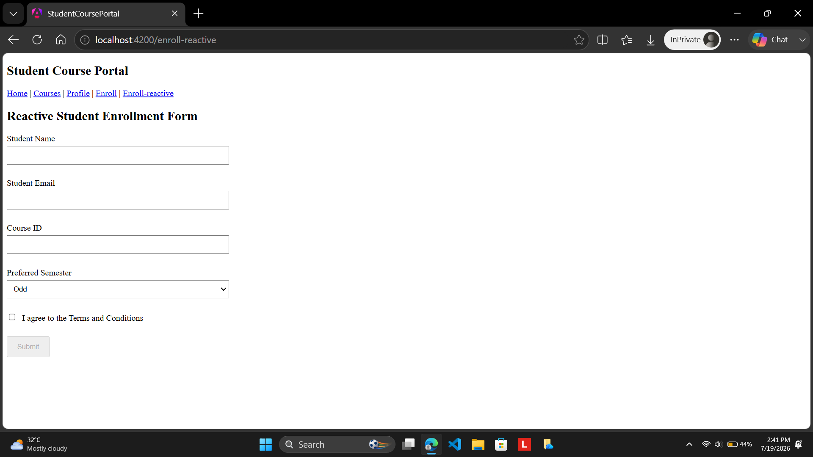
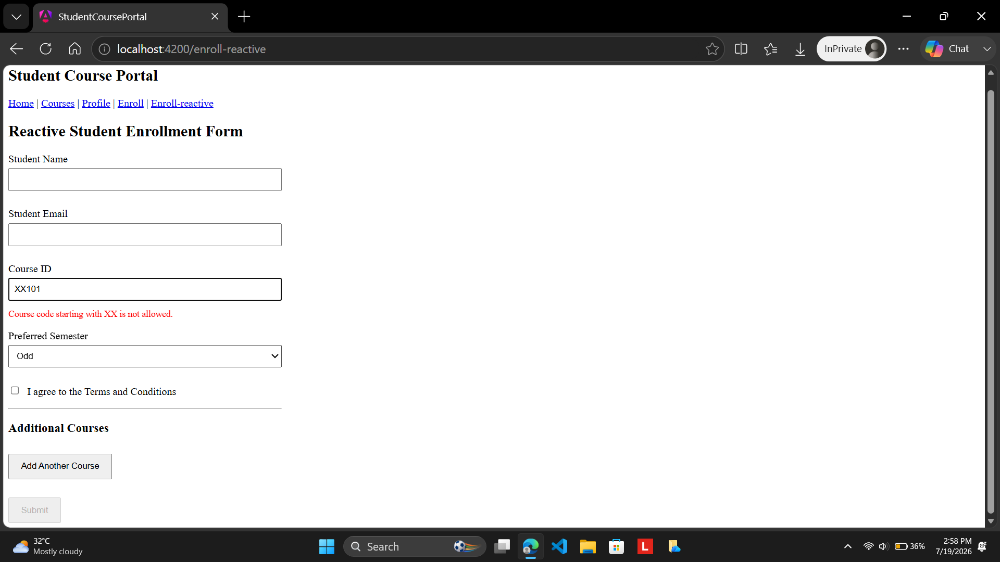
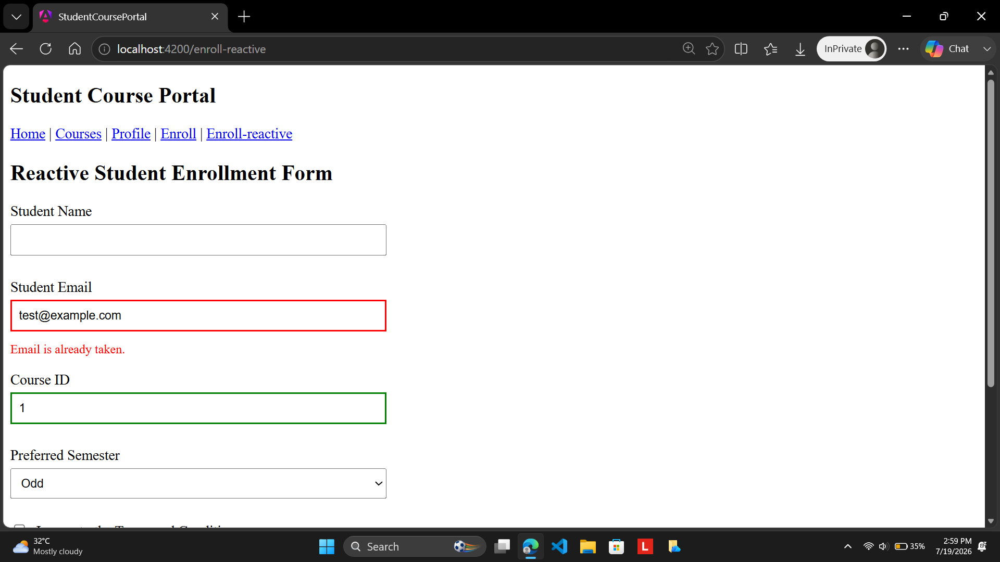
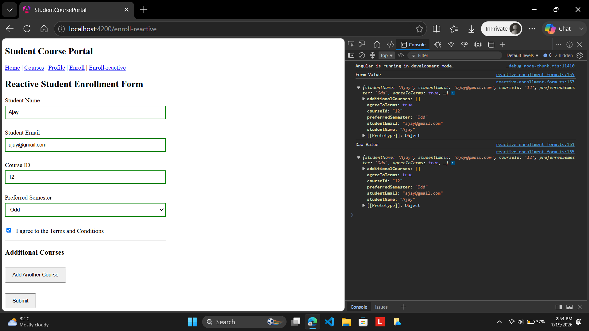

# Hands-On 5: Reactive Forms – FormBuilder, FormGroup, FormArray & Custom Validators

## Objective

The objective of this hands-on was to learn how Angular Reactive Forms are built and managed entirely within the component class using `FormBuilder`, `FormGroup`, `FormControl`, and `FormArray`. I implemented a reactive enrollment form for the Student Course Portal, applied built-in validators, created custom synchronous and asynchronous validators, dynamically managed multiple course inputs using `FormArray`, and handled form submission using Angular's reactive forms architecture.

## Project Structure

```text
student-course-portal/
│
├── src/
│   └── app/
│       │
│       ├── components/
│       │   ├── header/
│       │   │   ├── header.ts
│       │   │   ├── header.html
│       │   │   ├── header.css
│       │   │   └── header.spec.ts
│       │   │
│       │   └── course-card/
│       │       ├── course-card.ts
│       │       ├── course-card.html
│       │       ├── course-card.css
│       │       └── course-card.spec.ts
│       │
│       ├── directives/
│       │   ├── highlight.ts
│       │   └── highlight.spec.ts
│       │
│       ├── pipes/
│       │   ├── credit-label.ts
│       │   └── credit-label.spec.ts
│       │
│       ├── pages/
│       │   ├── home/
│       │   ├── course-list/
│       │   ├── student-profile/
│       │   ├── enrollment-form/
│       │   └── reactive-enrollment-form/
│       │       ├── reactive-enrollment-form.ts
│       │       ├── reactive-enrollment-form.html
│       │       ├── reactive-enrollment-form.css
│       │       └── reactive-enrollment-form.spec.ts
│       │
│       ├── app.ts
│       ├── app.html
│       ├── app.css
│       ├── app.routes.ts
│       └── app.config.ts
│
├── public/
├── angular.json
├── package.json
├── tsconfig.json
└── ...
```

## Task 1: Build a Reactive Form with FormBuilder

In this task, I created a new Reactive Enrollment Form component and configured a new route to access it through the Student Course Portal navigation. I imported the `ReactiveFormsModule` and used Angular's `FormBuilder` service to construct the complete form model inside the component class. I created a `FormGroup` consisting of controls for Student Name, Student Email, Course ID, Preferred Semester, and the Terms and Conditions checkbox. Each control was configured with appropriate built-in validators such as `required`, `minLength`, `email`, and `requiredTrue`. I connected the form to the HTML template using the `formGroup` directive and bound every input using `formControlName`, eliminating the need for `ngModel`. Finally, I implemented the submit functionality to log both `enrollForm.value` and `enrollForm.getRawValue()` to the browser console and ensured that the Submit button remained disabled until the form became valid.

## Task 2: Custom Validators and FormArray for Dynamic Controls

In this task, I extended the reactive form by implementing both synchronous and asynchronous custom validation. I created a custom synchronous validator that prevented Course IDs beginning with the prefix "XX" and displayed a meaningful validation message whenever an invalid value was entered. I also implemented an asynchronous validator that simulated a server-side email availability check by introducing an 800-millisecond delay and displaying an "Email is already taken" message whenever the entered email contained the prefix `test@`. To support dynamic user input, I created a `FormArray` named `additionalCourses`, allowing multiple additional course fields to be added or removed during runtime. I implemented dedicated methods for adding and removing controls dynamically and exposed the `FormArray` through a typed getter to simplify template binding while following Angular best practices.

## Expected Output

After successfully completing this hands-on, the application should:

1. Display the Reactive Enrollment Form through the `/enroll-reactive` route.
2. Build the complete form using Angular Reactive Forms and `FormBuilder`.
3. Bind all input fields using `formControlName`.
4. Validate all controls using Angular's built-in validators.
5. Display validation messages whenever invalid input is entered.
6. Reject Course IDs beginning with the prefix "XX" using a custom synchronous validator.
7. Display an "Email is already taken" message after asynchronous validation when the email contains `test@`.
8. Dynamically add and remove additional course fields using `FormArray`.
9. Log both `enrollForm.value` and `enrollForm.getRawValue()` when the form is submitted.
10. Enable the Submit button only after all validations have passed successfully.

## Output

### Task 1 – Reactive Enrollment Form



### Task 2 – Custom Synchronous Validator



### Task 2 – Asynchronous Email Validator



### Task 2 – Successful Reactive Form Submission



## Conclusion

Through this hands-on, I developed a comprehensive understanding of Angular Reactive Forms and their advantages over template-driven forms for building complex applications. I learned how Angular manages the complete form model inside the component class using `FormBuilder`, `FormGroup`, and `FormControl`, making the form logic easier to maintain and test. I implemented built-in validation together with custom synchronous and asynchronous validators, dynamically generated controls using `FormArray`, and handled complete form submission while examining both `enrollForm.value` and `enrollForm.getRawValue()`. This hands-on strengthened my understanding of Angular's reactive programming model and demonstrated how scalable, maintainable, and highly testable forms are developed in modern Angular applications.