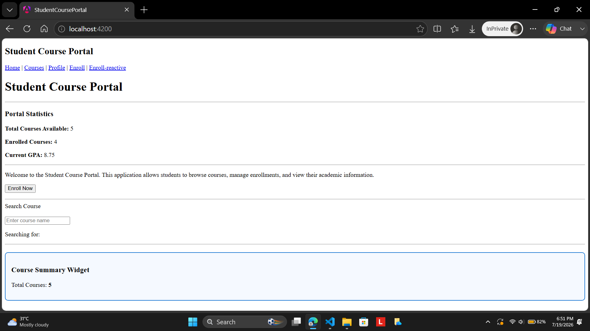
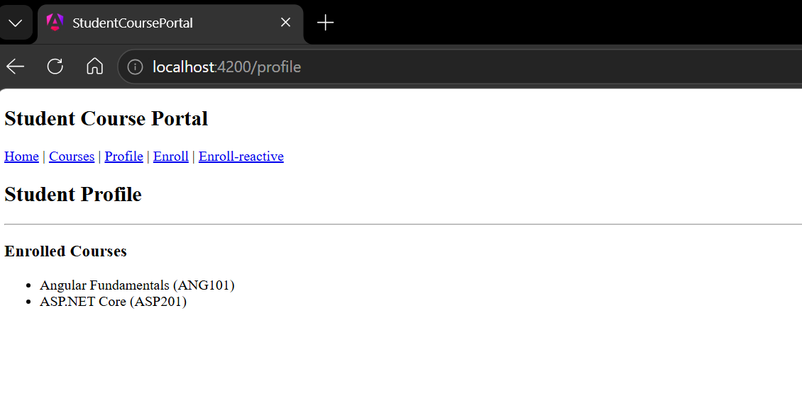
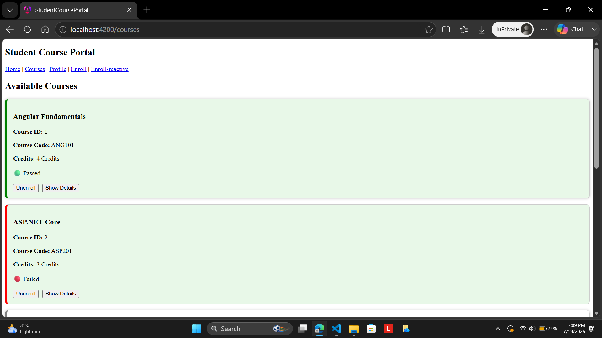

# Hands-On 6 – Services & Dependency Injection

# Objective

The objective of this hands-on is to understand Angular Services and Dependency Injection by creating reusable services, sharing application data across multiple components, implementing the Singleton Service pattern, demonstrating Service-to-Service Dependency Injection, and using component-level providers.

# Project Structure

```text
student-course-portal
│
├── components
│   ├── course-card
│   ├── course-summary-widget
│   ├── header
│   └── notification
│
├── directives
│
├── models
│   └── course.model.ts
│
├── pages
│   ├── home
│   ├── course-list
│   ├── student-profile
│   ├── enrollment-form
│   └── reactive-enrollment-form
│
├── pipes
│
└── services
    ├── course.ts
    ├── enrollment.ts
    └── notification.ts
```

# Implementation

## Task 1 – Course Service

### Step 1

Generated a CourseService.

```bash
ng generate service services/course
```
### Step 2

Created the Course interface.

```typescript
export interface Course {

  id: number;

  name: string;

  code: string;

  credits: number;

  gradeStatus: 'passed' | 'failed' | 'pending';

}
```
### Step 3

Implemented the CourseService.

```typescript
@Injectable({
  providedIn: 'root'
})
export class CourseService {

  getCourses(): Course[] { }

  getCourseById(id: number): Course | undefined { }

  addCourse(course: Course): void { }

}
```

### Step 4

Injected the CourseService into the CourseListComponent.

```typescript
constructor(
    private courseService: CourseService
) { }

ngOnInit(): void {

    this.courses =
        this.courseService.getCourses();

}
```

### Step 5

Injected the CourseService into the HomeComponent.

```typescript
this.totalCourses =
    this.courseService.getCourses().length;
```

### Step 6

Created the Course Summary Widget.

```typescript
constructor(
    private courseService: CourseService
){}

ngOnInit(){

    this.totalCourses =
        this.courseService.getCourses().length;

}
```

This demonstrated that multiple components share the same singleton service instance.

 

# Task 2 – Enrollment Service

### Step 1

Generated EnrollmentService.

```bash
ng generate service services/enrollment
```

### Step 2

Implemented EnrollmentService.

```typescript
@Injectable({
  providedIn: 'root'
})
export class EnrollmentService {

    enroll(courseId:number){}

    unenroll(courseId:number){}

    isEnrolled(courseId:number){}

    getEnrolledCourses(){}

}
```

### Step 3

Injected CourseService inside EnrollmentService.

```typescript
constructor(
    private courseService: CourseService
){}
```

This demonstrates **Service-to-Service Dependency Injection**.

### Step 4

Updated CourseCardComponent.

```typescript
constructor(
    private enrollmentService: EnrollmentService
){}

get isEnrolled(){

    return this.enrollmentService
           .isEnrolled(this.course.id);

}
```

### Step 5

Implemented Enroll / Unenroll.

```typescript
enroll(){

    if(this.isEnrolled){

        this.enrollmentService
            .unenroll(this.course.id);

    }

    else{

        this.enrollmentService
            .enroll(this.course.id);

    }

}
```

### Step 6

Displayed enrolled courses in Student Profile.

```typescript
get enrolledCourses(){

    return this.enrollmentService
               .getEnrolledCourses();

}
```

### Step 7

Created NotificationService.

```bash
ng generate service services/notification
```

### Step 8

Created Notification Component.

```bash
ng generate component components/notification
```

### Step 9

Provided NotificationService at component level.

```typescript
@Component({

    providers:[
        NotificationService
    ]

})
```

This creates a new NotificationService instance for every NotificationComponent rather than sharing the singleton instance.

# Dependency Injection Hierarchy

## Root-Level Services

- CourseService
- EnrollmentService

Both services are singleton services shared across the application.

```typescript
@Injectable({
    providedIn:'root'
})
```

## Component-Level Service

NotificationService is provided inside NotificationComponent.

```typescript
providers:[
    NotificationService
]
```

Each NotificationComponent receives its own isolated service instance.
## Output

### handson6_task1_course_service



Shows:

- Home Page
- Total Courses Available
- Course Summary Widget

### handson6_task2_enrollment_service



Shows:

- Student Profile
- Enrolled Courses

### handson6_course_toggle



Shows:

- Course page
- Unenroll button
- Green enrolled card

# Learning Outcome

Successfully implemented Angular Services and Dependency Injection concepts by creating reusable services, sharing data between components using the Singleton Service pattern, performing Service-to-Service Injection, and demonstrating component-scoped providers. The application now uses centralized business logic, shared application state, and reusable services to improve maintainability and scalability.