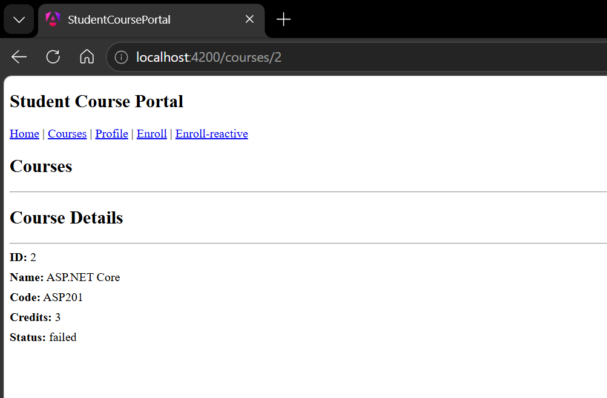
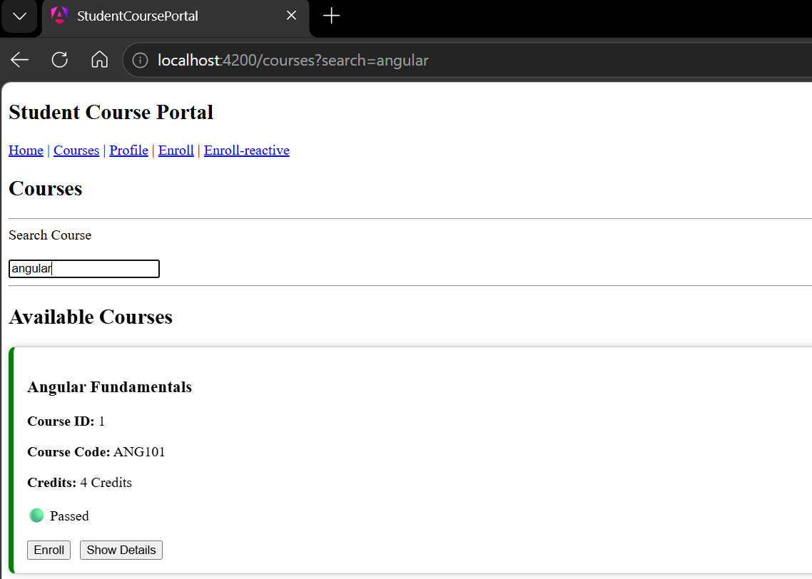
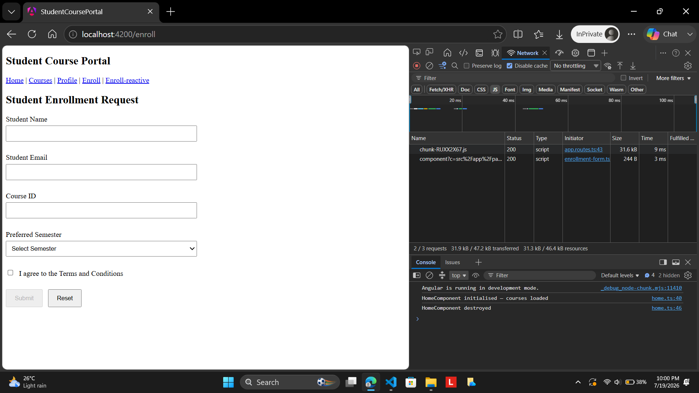
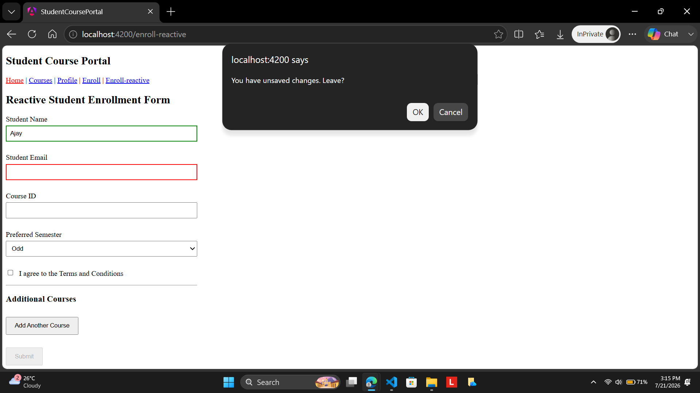

# Hands-On 7 – Angular Routing, Guards, Lazy Loading & Route Data

## Objective

The objective of this hands-on is to understand Angular routing concepts by configuring application routes, implementing route parameters, query parameters, nested routes, lazy loading, route guards, and navigation protection within the Student Course Portal application.

# Project Structure(upto Handson-7)

```
src
│
├── app
│
├── guards
│   ├── auth.ts
│   └── unsaved-changes.ts
│
├── services
│   └── auth.ts
│
├── layouts
│   └── courses-layout
│
├── pages
│   ├── home
│   ├── course-list
│   ├── course-detail
│   ├── enrollment-form
│   ├── reactive-enrollment-form
│   ├── student-profile
│   └── not-found
│
├── app.routes.ts
│
└── ...
```

 

# Implementation

## Task 1 – Route Configuration

Configured application routes using the standalone router.

Implemented routes for:

- Home
- Courses
- Course Details
- Student Profile
- Enrollment Form
- Reactive Enrollment Form
- Not Found Page

Example:

```typescript
{
  path: '',
  component: Home
}
```

```typescript
{
  path: '**',
  component: NotFound
}
```

## Task 2 – Route Parameters

Generated a CourseDetail component.

Used **ActivatedRoute** to read the route parameter.

```typescript
const id = Number(
  this.route.snapshot.paramMap.get('id')
);
```

Loaded the selected course using CourseService.

```typescript
this.course =
this.courseService.getCourseById(id);
```

 

## Task 3 – Navigation using Router

Course cards were made clickable.

```typescript
this.router.navigate([
'courses',
course.id
]);
```

Clicking a course now opens

```
/courses/{id}
```

## Task 4 – Query Parameters

Implemented query parameters for searching.

Example:

```typescript
this.router.navigate(
['/courses'],
{
queryParams:
{
search: this.searchTerm
}
});
```

Reading query parameters:

```typescript
this.route.snapshot
.queryParamMap
.get('search');
```

## Task 5 – Nested Routes

Created a Courses Layout component.

Configured nested routes.

```typescript
{
path:'courses',
component:CoursesLayout,
children:[
{
path:'',
component:CourseList
},
{
path:':id',
component:CourseDetail
}
]
}
```

Added

```html
<router-outlet></router-outlet>
```

to render child routes.

## Task 6 – Lazy Loading

Since the project uses **Angular 20 Standalone Components**, lazy loading was implemented using **loadComponent()** instead of feature modules.

```typescript
{
path:'enroll',

loadComponent:()=>

import('./pages/enrollment-form/enrollment-form')

.then(c=>c.EnrollmentForm)
}
```

Reactive Enrollment Form was also lazily loaded.

This ensures the Enrollment pages are downloaded only when the route is visited.


## Task 7 – Auth Service

Created an AuthService.

```typescript
@Injectable({
providedIn:'root'
})
```

Added a simple authentication flag.

```typescript
isLoggedIn = true;
```

This service is shared throughout the application using Angular Dependency Injection.


## Task 8 – CanActivate Guard

Generated an Auth Guard.

Protected routes:

- Profile
- Enrollment Form

Guard implementation:

```typescript
if(authService.isLoggedIn){

return true;

}

router.navigate(['/']);

return false;
```

If the user is not logged in, navigation redirects to the Home page.

 

## Task 9 – CanDeactivate Guard

Generated an Unsaved Changes Guard.

Created the interface:

```typescript
export interface
CanComponentDeactivate{

canDeactivate():
boolean;

}
```

Reactive Enrollment Form implements this interface.

```typescript
canDeactivate(): boolean {

if(this.enrollForm.dirty){

return window.confirm(
'You have unsaved changes. Leave?'
);

}

return true;

}
```

If the form contains unsaved data, Angular displays a confirmation dialog before leaving the page.

## Output

### Course Detail



Shows:

- URL `/courses/2`
- Course Detail page displaying selected course

### Query Parameter



Shows:

- URL containing `?search=angular`
- Filter/Search functionality

### Lazy Loading



Shows:

- Enrollment page
- Chrome DevTools
- Network tab
- Lazy-loaded JavaScript chunk

### Unsaved Changes



Shows:

- Reactive Enrollment Form
- Unsaved changes confirmation dialog
- Partially filled form
# Learning Outcomes

After completing this hands-on, I learned how to:

- Configure Angular standalone routes.
- Navigate using Angular Router.
- Pass route and query parameters.
- Implement nested routing.
- Use lazy loading with standalone components.
- Protect routes using CanActivate Guards.
- Prevent accidental navigation using CanDeactivate Guards.
- Handle dynamic routing in Angular applications.
- Build scalable routing architecture using Angular 20 standalone features.

# Result

Successfully implemented Angular Routing, Route Parameters, Query Parameters, Nested Routing, Lazy Loading using Standalone Components, CanActivate Guards, and CanDeactivate Guards for the Student Course Portal application.