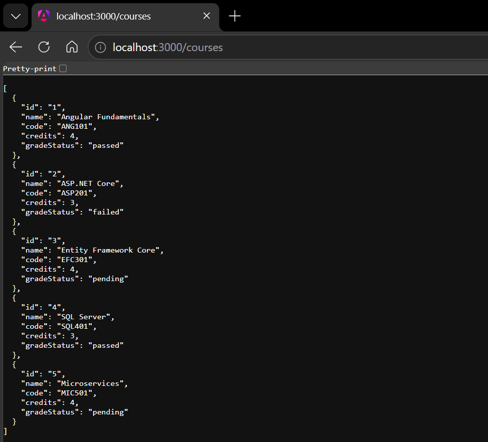
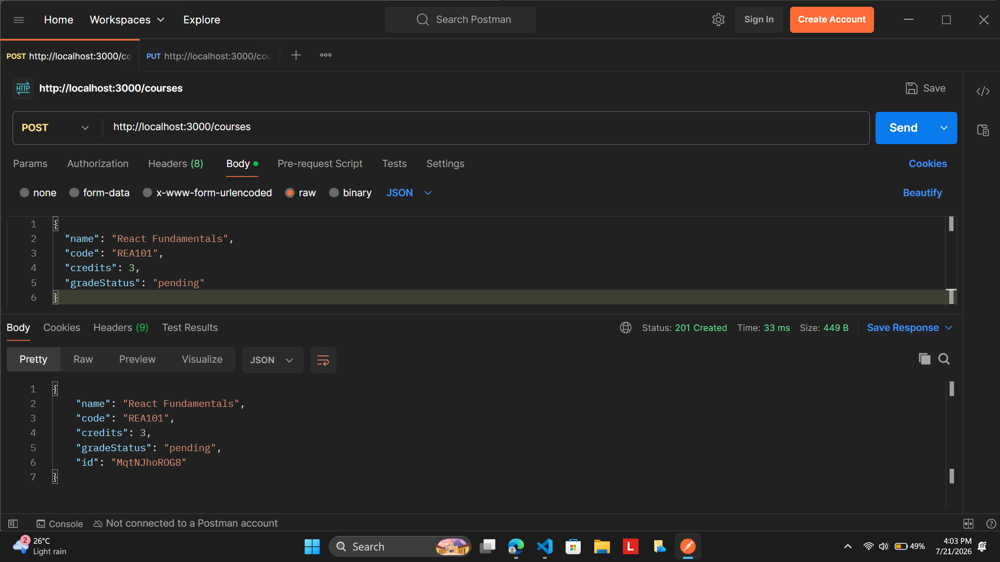
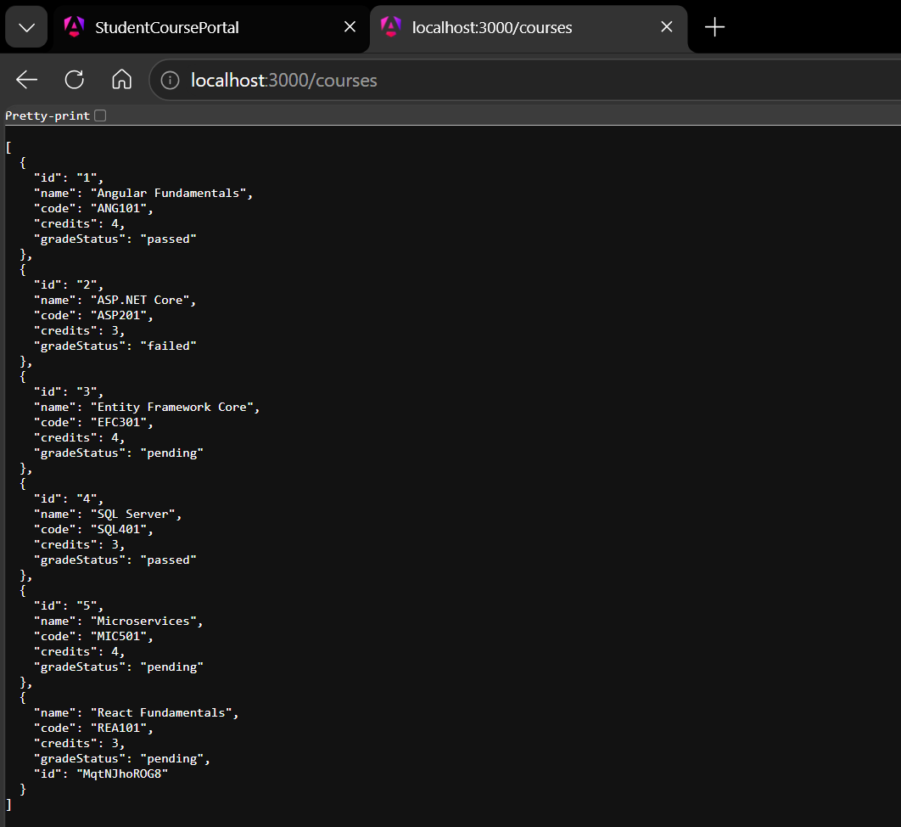
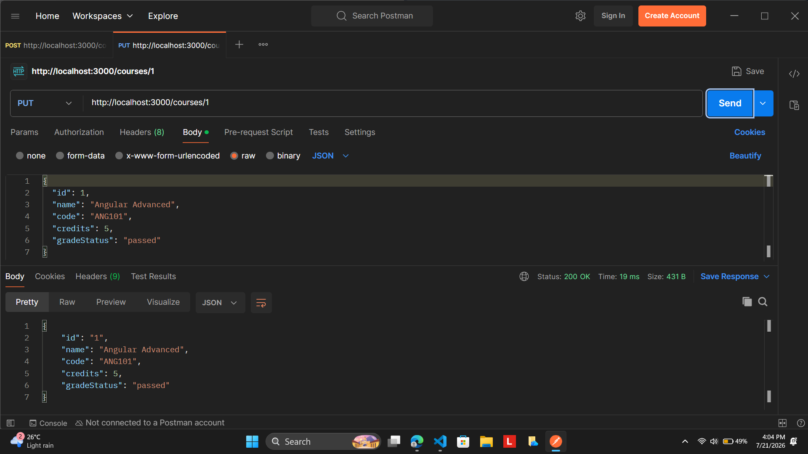
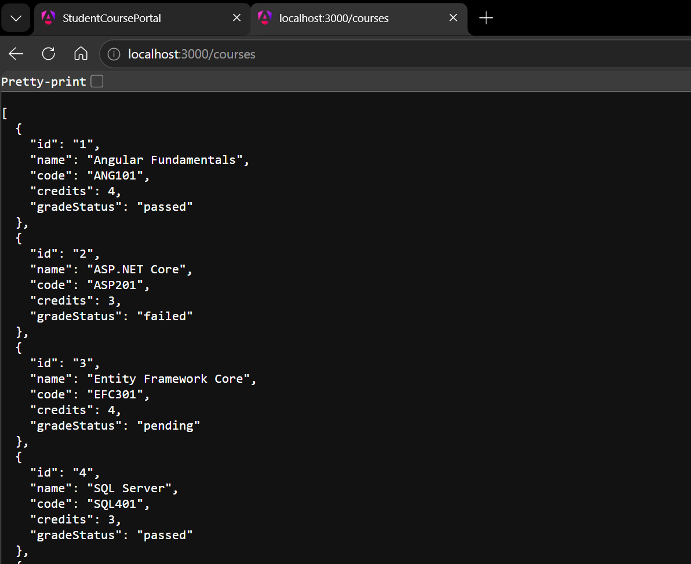
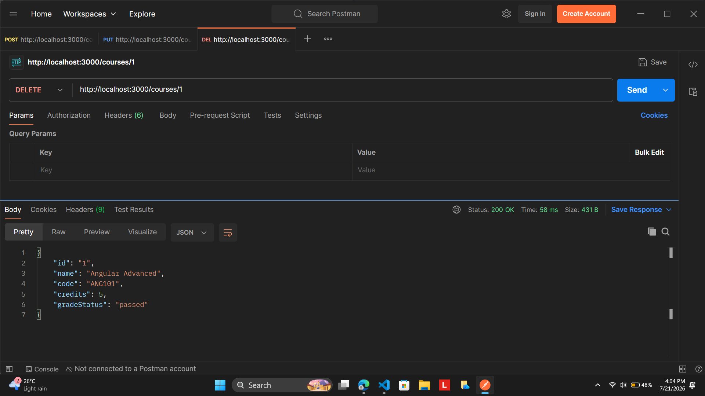
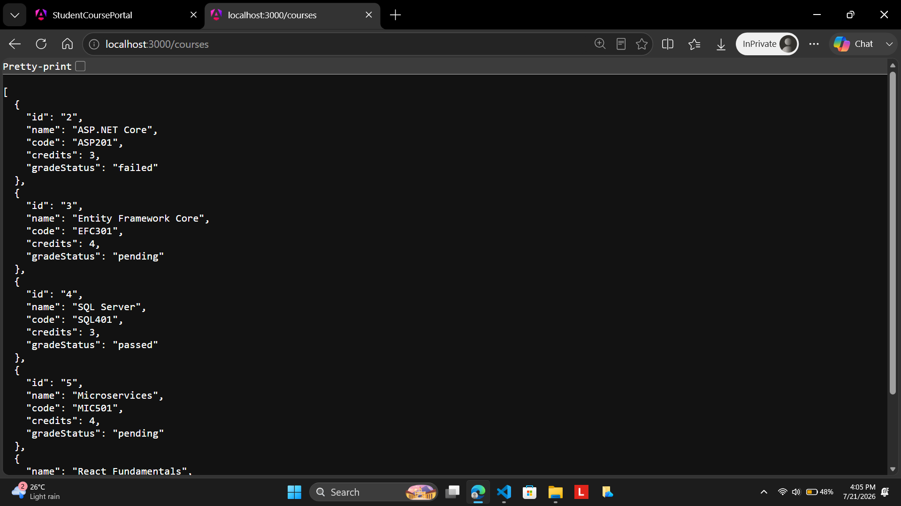
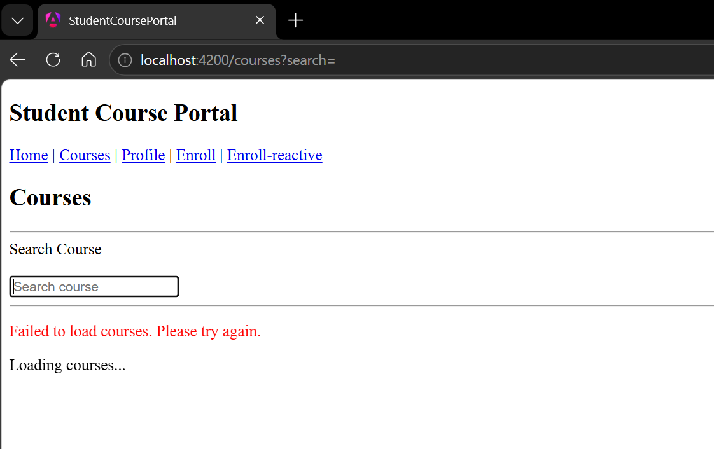
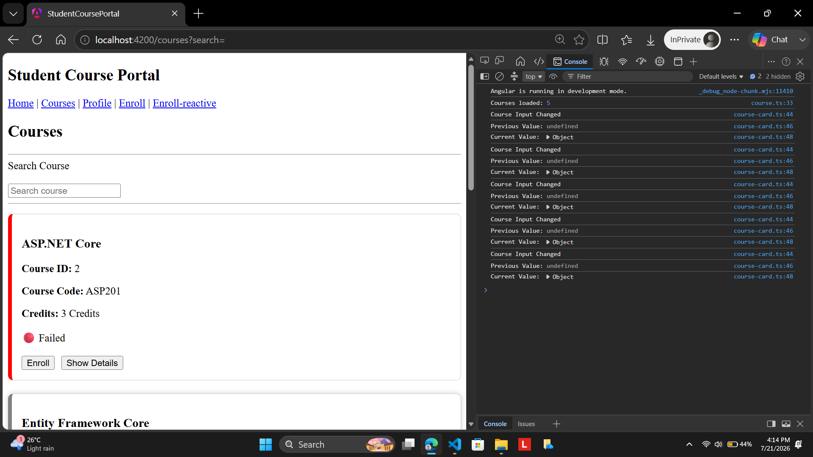
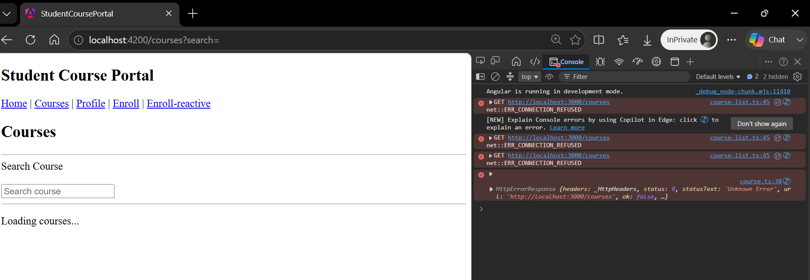

# Hands-On 8 – HTTP Client, API Integration, Observables & Interceptors

## Objective

The objective of this hands-on is to integrate the Student Course Portal with a REST API using Angular HttpClient, replace hardcoded data with HTTP requests, work with Observables and RxJS operators, implement CRUD operations, handle HTTP errors, and create HTTP interceptors for authentication, global error handling, and loading indication.

# Project Structure (up to Hands-On 8)

```text
src
│
├── app
│
├── interceptors
│   ├── auth.interceptor.ts
│   ├── error-handler.interceptor.ts
│   └── loading-interceptor.ts
│
├── services
│   ├── course.ts
│   ├── enrollment.ts
│   ├── auth.ts
│   └── loading.ts
│
├── models
│   └── course.model.ts
│
├── pages
│   ├── course-list
│   ├── course-detail
│   ├── enrollment-form
│   ├── reactive-enrollment-form
│   ├── student-profile
│   └── ...
│
├── app.config.ts
│
└── ...
```

# Implementation

## Task 1 – Configure HttpClient

Configured Angular HttpClient using the standalone API.

```typescript
provideHttpClient(
  withInterceptors([
    authInterceptor,
    errorHandlerInterceptor,
    loadingInterceptor
  ])
)
```

This enables HTTP communication throughout the application.

 

## Task 2 – Replace Hardcoded Data with API Calls

Refactored the CourseService to fetch data from JSON Server.

```typescript
getCourses(): Observable<Course[]> {

  return this.http.get<Course[]>(
    'http://localhost:3000/courses'
  );

}
```

Implemented loading a single course.

```typescript
getCourseById(id:number): Observable<Course>{

return this.http.get<Course>(
`http://localhost:3000/courses/${id}`
);

}
```

The application now retrieves live data instead of using an in-memory array.

 

## Task 3 – CRUD Operations

Implemented Create, Update and Delete methods.

Create Course

```typescript
createCourse(course:any){

return this.http.post<Course>(
'http://localhost:3000/courses',
course
);

}
```

Update Course

```typescript
updateCourse(id:number,course:Course){

return this.http.put<Course>(
`http://localhost:3000/courses/${id}`,
course
);

}
```

Delete Course

```typescript
deleteCourse(id:number){

return this.http.delete(
`http://localhost:3000/courses/${id}`
);

}
```

These operations were tested using JSON Server and Postman.

 

## Task 4 – Component Subscription

CourseListComponent subscribes to the Observable returned by CourseService.

```typescript
this.courseService
.getCourses()
.subscribe({

next:courses=>{

this.courses=courses;

},

error:err=>{

this.errorMessage=err.message;

},

complete:()=>{

this.isLoading=false;

}

});
```

The UI automatically updates when the HTTP response is received.

 

## Task 5 – RxJS Operators

Applied multiple RxJS operators.

Filtering response

```typescript
map(courses=>

courses.filter(c=>c.credits>0)

)
```

Logging

```typescript
tap(courses=>{

console.log(
'Courses loaded:',
courses.length
);

})
```

Retry failed requests

```typescript
retry(2)
```

Error handling

```typescript
catchError(err=>{

return throwError(

()=>new Error(
'Failed to load courses.'
)

);

})
```

These operators improve reliability and readability of HTTP requests.

 

## Task 6 – switchMap

Used switchMap for dependent HTTP requests.

```typescript
switchMap(courseId=>

this.enrollmentService
.getStudentsByCourse(courseId)

)
```

switchMap automatically cancels previous HTTP requests when a newer request is made.

 

## Task 7 – Authentication Interceptor

Created an Authentication Interceptor.

```typescript
const authRequest = req.clone({

setHeaders:{

Authorization:
'Bearer mock-token-12345'

}

});
```

Every outgoing HTTP request automatically contains the Authorization header.

 

## Task 8 – Global Error Interceptor

Created a global HTTP Error Interceptor.

```typescript
catchError(error=>{

console.error(error);

return throwError(
()=>error
);

})
```

Centralized error handling avoids duplicate error-handling code inside every service.

 

## Task 9 – Loading Interceptor

Created a LoadingService using BehaviorSubject.

```typescript
isLoading$ = new BehaviorSubject<boolean>(false);
```

The Loading Interceptor controls the loading state.

```typescript
loadingService
.isLoading$
.next(true);

...

finalize(()=>{

loadingService
.isLoading$
.next(false);

});
```

A loading indicator is displayed while HTTP requests are executing and automatically disappears when the request completes.
# Output

## Task 1 – JSON Server Running

Shows JSON Server serving the mock backend on port **3000**.



Shows the Student Course Portal loading course data from JSON Server using **HttpClient GET**.

## Task 3 – POST Request

Shows successful creation of a new course using **HTTP POST**.




## Task 4 – PUT Request

Shows successful update of an existing course using **HTTP PUT**.



 

## Task 5 – DELETE Request

Shows successful deletion of a course using **HTTP DELETE**.



 

## Task 6 – Error Handling

Shows the application displaying an error message when JSON Server is unavailable.



 

## Task 7 – RxJS tap() Logging

Shows the browser console logging the number of courses loaded using the **tap()** operator.




## Task 8 – Retry Strategy

Shows failed HTTP requests being retried before displaying the final error.



# Learning Outcomes

After completing this hands-on, I learned how to:

* Configure HttpClient in Angular standalone applications.
* Replace hardcoded data with REST API calls.
* Perform GET, POST, PUT and DELETE operations.
* Work with Observables instead of Promises.
* Subscribe to HTTP Observables.
* Use RxJS operators such as map, tap, retry, catchError and switchMap.
* Implement centralized HTTP error handling.
* Create Authentication Interceptors.
* Build Loading Interceptors using BehaviorSubject.
* Register multiple HTTP Interceptors using provideHttpClient().
* Integrate Angular applications with JSON Server.

# Result

Successfully integrated the Student Course Portal with a REST API using Angular HttpClient, implemented CRUD operations, applied RxJS operators for data transformation and error handling, and configured Authentication, Error Handling, and Loading Interceptors to build a scalable Angular application using Angular 20 standalone features.
